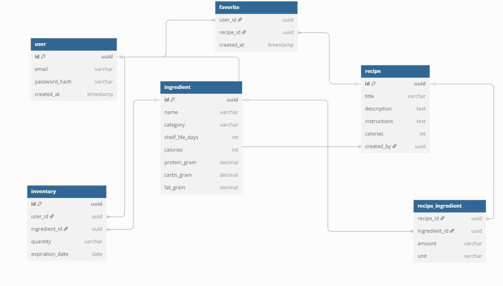

# Anforderungs- und Entwurfsspezifikation ("Pflichtenheft")
# 0 Titelseite

Danny Meihöfer - 1323212

Bjarne Zaremba - 1320828

[Link zum Source Code Repository](https://github.com/Mealo-Hsbi/Mealo)

# Inhaltsverzeichnis

- [1 Einführung](#1-Einführung)
  - [1.1 Beschreibung](#11-beschreibung)
- [2 Anforderungen](#2-anforderungen)
  - [2.1 Stakeholder](#21-stakeholder)
  - [2.2 Funktionale Anforderungen](#22-funktionale-anforderungen)
  - [2.3 Nicht-funktionale Anforderungen](#23-nicht-funktionale-anforderungen)
    - [2.3.1 Rahmenbedingungen](#231-rahmenbedingungen)
    - [2.3.2 Betriebsbedingungen](#232-betriebsbedingungen)
    - [2.3.3 Qualitätsmerkmale](#233-qualitätsmerkmale)
  - [2.4 Benutzergruppen & Personas](#24-benutzergruppen--personas)
  - [2.5 Wirtschaftlichkeitsbetrachtung](#25-wirtschaftlichkeitsbetrachtung)
  - [2.6 Graphische Benutzerschnittstelle](#24-graphische-benutzerschnittstelle)
  - [2.7 Anforderungen im Detail](#25-anforderungen-im-detail)
- [3 Technische Beschreibung](#3-technische-beschreibung)
  - [3.1 Systemübersicht](#31-systemübersicht)
  - [3.2 Softwarearchitektur](#32-softwarearchitektur)
    - [3.2.1 Technologieauswahl](#321-technologieauswahl)
  - [3.3 Schnittstellen](#33-schnittstellen)
    - [3.3.1 Ereignisse](#331-ereignisse)
  - [3.4 Datenmodell](#34-datenmodell)
  - [3.5 Fehlerbehandlung](#37-fehlerbehandlung)
  - [3.6 Validierung](#38-validierung)
- [4 Projektorganisation](#4-projektorganisation)
  - [4.1 Annahmen](#41-annahmen)
  - [4.2 Verantwortlichkeiten](#42-verantwortlichkeiten)
  - [4.3 Grober Projektplan](#43-grober-projektplan)

# 1 Einführung [ ](#inhaltsverzeichnis)

## 1.1 Beschreibung [ ](#inhaltsverzeichnis)

**Mealo** ist dein smarter Küchenbegleiter – eine mobile App, die dich nicht nur bei der Rezeptsuche unterstützt, sondern dich wie ein virtueller Koch an der Seite durch deinen kulinarischen Alltag führt.  

Im Zentrum steht eine intelligente Zutatenerkennung: Du kannst vorhandene Lebensmittel einfach einscannen – per Kamera, Barcode oder manueller Eingabe – und bekommst sofort passende Rezeptvorschläge, die deine Vorräte optimal nutzen. Doch Mealo kann weit mehr als das.

Die App bietet eine Vielzahl nützlicher Funktionen:  
- **Individuelle Filteroptionen** nach Zeitaufwand, Ernährungsform (z. B. vegan, glutenfrei), Schwierigkeitsgrad oder vorhandenen Küchengeräten  
- **Gericht-Erkennung**: Fotografiere ein fertiges Essen, um die wahrscheinlichen Zutaten zu identifizieren – ideal wenn ein leckeres Gericht nachgekocht werden soll!
- **Kalorien- und Nährwertübersicht** für jedes Rezept – für alle, die bewusst kochen oder sportliche Ziele verfolgen  
- **Einkaufslistenfunktion** für fehlende Zutaten, direkt aus dem Rezept heraus generierbar  
- **Food-Waste-Vermeidung** durch clevere Resteverwertung und Fokus auf vorhandene Lebensmittel  
- **Intelligente Wochenplanung**: Auf Basis deiner Ziele, Vorlieben und Vorräte erstellt Mealo automatisch einen wöchentlichen Essensplan – samt Rezepte, Einkaufsliste und Kalorienübersicht
- **Geführtes Kochen**: Schritt-für-Schritt-Anleitungen, bei denen der Nutzer von der App durch den gesamten Kochprozess begleitet wird, inklusive Timer und Sprachsteuerung für eine freihändige Bedienung
- **Community & Inspiration**: Nutzer können eigene Rezepte posten, die anderer entdecken und bewerten - für noch mehr kulinarische Vielfalt.

Und noch mehr.

Mealo richtet sich an alle, die gesünder, effizienter oder kreativer kochen möchten – vom Studierenden mit leerem Kühlschrank bis hin zum Fitness-Fan mit Meal-Prep-Plan. Die App ersetzt kein Kochbuch, sondern bietet das Wissen eines erfahrenen Kochs – in digitaler, interaktiver Form.  

Ob spontane Idee oder gezielte Planung: Mealo bringt Intelligenz, Inspiration und Nachhaltigkeit auf den Teller.

Ein Koch in deiner Hosentasche.

---

# 2 Anforderungen [ ](#inhaltsverzeichnis)

In diesem Abschnitt werden die funktionalen und nicht-funktionalen Anforderungen an das System Mealo systematisch erfasst. Ziel ist es, die Erwartungen und Bedürfnisse aller Beteiligten – insbesondere der Endnutzer – zu verstehen und in konkrete Anforderungen zu übersetzen. Die Anforderungen bilden die Grundlage für die spätere Systemarchitektur, die Umsetzung sowie für Tests und Abnahmen. Dabei wird sowohl auf die Stakeholder eingegangen als auch auf die konkreten Funktionen und Qualitätsmerkmale, die die Anwendung erfüllen soll.

---

## 2.1 Stakeholder [ ](#inhaltsverzeichnis)

| Funktion / Relevanz | Name | Kontakt / Verfügbarkeit | Wissen | Interessen / Ziele |
|---|---|---|---|---|
| Full-Stack Entwickler | Danny Meihöfer | danny.meihoefer@hsbi.de |  Technische Umsetzung und Organisation | Entwicklung einer funktionalen und kreativen App, Praxiserfahrung sammeln |
| Full-Stack Entwickler | Bjarne Zaremba | bjarne_linus.zaremba@hsbi.de | Technische Umsetzung und Organisation  | Technisch saubere Umsetzung, praxisnahe Anwendung entwickeln |
| Endnutzer (Zielgruppe), Einfluss auf Nutzerakzeptanz | Breite Nutzerschaft (z. B. Studierende, Berufstätige, Kochinteressierte) | indirekt über Umfragen, Feedback und Tests erreichbar | Kennt Alltagsprobleme rund ums Kochen, Einkaufen und Planen | Vereinfachung des Kochalltags, smarte Vorschläge, Zeit- und Ressourcenersparnis |
| Projektbetreuer (Dozent) | Prof. Dr. Jörg Brunsmann | über Hochschul-Mail erreichbar | Betreuung des Projekts im Rahmen der Lehrveranstaltung, methodische Unterstützung | Didaktisch strukturierter Projektverlauf, Zielerreichung und Dokumentation |

---

## 2.2 Funktionale Anforderungen [ ](#inhaltsverzeichnis)

Die folgende Liste beschreibt die funktionalen Anforderungen an die Anwendung *Mealo*. Sie ergeben sich aus der Zielsetzung der App und den geplanten Features. Die Anforderungen sind in thematische Gruppen unterteilt, um eine bessere Übersichtlichkeit zu gewährleisten.

### Akteure
- **Nutzer**: Verwender der App, gibt Zutaten ein, erhält Rezepte, erstellt Pläne etc.
- **System**: Die App selbst, die Benutzerinteraktionen verarbeitet, Vorschläge berechnet, Daten speichert und darstellt.

---

### 1. Zutatenverwaltung
- **FA-1.1**: Der Nutzer kann Zutaten manuell eingeben.
- **FA-1.2**: Über ein Foto-Upload können mehrere Lebensmittel gleichzeitig automatisch erkannt und übernommen werden.
- **FA-1.3**: Der Nutzer kann Zutaten aus einer Liste löschen oder bearbeiten.
- **FA-1.4**: Die App speichert eingegebene Zutaten lokal und/oder in der Cloud.
- **FA-1.5**: Die App kann den Barcode von Lebensmitteln scannen und die entsprechenden Zutaten automatisch hinzufügen.
- **FA-1.6**: Die App kann sich die Zutaten merken und speichert:
  - Name
  - Menge
  - Haltbarkeitsdatum
  - Kategorie (z. B. Obst, Gemüse, Fleisch, etc.)
  - Häufigkeit der Nutzung
- **FA-1.7**: Die App kann für bestimmte Zutaten prüfen, ob diese in nahegelegenen Supermärkten verfügbar sind (z. B. über eine Drittanbieter-Schnittstelle, wenn verfügbar).
- **FA-1.8**: Die App kann aktuelle Supermarktangebote durchsuchen und relevante Produkte basierend auf dem aktuellen Vorrat und dem Rezeptbedarf herausfiltern. Dabei werden nahliegende Supermärkte, Rabattaktionen und eventuell beworbene Produkte (Product Placements) berücksichtigt.

---

### 2. Rezeptvorschläge
- **FA-2.1**: Die App schlägt dem Nutzer Rezepte vor, basierend auf den vorhandenen Zutaten.
- **FA-2.2**: Rezepte werden nach verschiedenen Kriterien filterbar sein (z. B. vegan, kalorienarm, schnell, Resteverwertung, Equipment).
- **FA-2.3**: Die App zeigt eine Bewertung und geschätzte Zubereitungszeit an.
- **FA-2.4**: Die App zeigt die fehlenden Zutaten bei einem Rezept an, das nicht vollständig passt und gibt einem die Möglichkeit, diese zur Einkaufsliste hinzuzufügen.
- **FA-2.5**: Der Nutzer kann Rezepte als Favoriten speichern.

---

### 3. Wochenplanung & Einkauf
- **FA-3.1**: Der Nutzer kann Rezepte zu einem Wochenplan hinzufügen.
- **FA-3.2**: Basierend auf dem Wochenplan kann die App automatisch eine Einkaufsliste generieren.
- **FA-3.3**: Die Einkaufsliste kann manuell bearbeitet werden.
- **FA-3.4**: Die App kann Zutaten aus der Einkaufsliste nach dem Einkauf dem Vorrat hinzufügen.
- **FA-3.5**: Die App kann automatisch Rezepte für die Woche vorschlagen, basierend auf den Vorräten und Vorlieben des Nutzers.

---

### 4. Benutzerkonto & Datenhaltung
- **FA-4.1**: Der Nutzer kann ein Benutzerkonto erstellen und sich einloggen.
- **FA-4.2**: Die App speichert Nutzerdaten, Einstellungen und Historien benutzerbezogen.
- **FA-4.3**: Die App bietet die Möglichkeit, das Konto zu löschen und alle Daten zu entfernen.

---

### 5. Geführtes Kochen

- **FA-5.1**: Die App führt den Nutzer Schritt für Schritt durch das Rezept, wobei jeder Schritt klar hervorgehoben und nach Bedarf detailliert angezeigt wird.
- **FA-5.2**: Für Prozesse, die eine bestimmte Zeit erfordern (z. B. Kochen, Backen), kann der Nutzer direkt einen Timer starten, der im Hintergrund weiterläuft.
- **FA-5.3**: Die App bietet Sprachsteuerung, sodass der Nutzer Befehle wie “Weiter”, “Zurück”, “Starte Timer” oder “Wie lange noch?” geben kann, ohne die Hände zu benutzen.
- **FA-5.4**: Ein akustisches oder visuelles Feedback erfolgt, wenn ein Timer abgelaufen ist, um den Nutzer zu informieren.
- **FA-5.5**: Der geführte Modus kann optional aktiviert werden, indem der Nutzer gefragt wird, ob er die Funktion für das jeweilige Rezept nutzen möchte.
- **FA-5.6**: Die App erlaubt das gleichzeitige Starten und Verwalten von mehreren Timern für verschiedene Prozesse, wenn dies im Rezept erforderlich ist.

---

### 6. Community & Rezept-Sharing
- **FA-6.1**: Nutzer können eigene Rezepte anlegen und veröffentlichen.
- **FA-6.2**: Nutzer können Rezepte von anderen entdecken, speichern oder bewerten.
- **FA-6.3**: Rezepte könnenm it Bildern, Zutaten, Nährweten und Zubereitungsschritten versehen werden.

### 7. Erweiterte Funktionen

- **FA-7.1**: Die App kann eine Kalorienübersicht basierend auf gewählten Rezepten anzeigen.
- **FA-7.2**: Die App kann Rezepte auf Basis von Fitness-Zielen (z. B. Muskelaufbau, Diät) filtern.
- **FA-7.3**: Die App merkt sich Nutzerpräferenzen und passt Vorschläge personalisiert an.
- **FA-7.4**: Die App kann Makroskopische Daten (z. B. Eiweiß, Kohlenhydrate, Fette) für Rezepte anzeigen und die des Nutzers trackbar machen.
- **FA-7.5**: Sprachsteuerung für die Eingabe von Zutaten und navigation durch Rezepte.

---

## 2.3 Nicht-funktionale Anforderungen [ ](#inhaltsverzeichnis)

### 2.3.1 Rahmenbedingungen [ ](#inhaltsverzeichnis)

**Zielplattformen**:  
Die Anwendung wird primär als mobile App (Android und eventuell IOS) entwickelt.

**Programmiersprachen / Frameworks**:  
Es werden moderne App-Technologien verwendet (z. B. JavaScript/TypeScript, Dart, Flutter).

**Backend**:  
RESTful API oder GraphQL mit Node.js als mögliche Backend-Technologien.

**Datenhaltung**:  
Nutzung einer Cloud-Datenbank (z. B. Firebase, Supabase, Google Cloud) für Nutzerkonten, Zutaten und Rezepte.

**Schnittstellen / APIs**:  
Externe APIs:
  - Spoonacular, Edamam oder ähnliche für Rezeptdaten und Nährwertinformationen.
  - Google Vision API oder OpenCV für die Bildverarbeitung und Zutatenerkennung.

**Gerätevoraussetzungen**:  
Mindestvoraussetzung ist ein Smartphone mit Kamera und Internetzugang.

**Sprachunterstützung**:  
Primär Englisch, mittelfristig mehrsprachige Erweiterung geplant.

---

### 2.3.2 Betriebsbedingungen [ ](#inhaltsverzeichnis)

**Betriebsumgebung**:  
- **Server**: Cloud-Hosting-Dienste (z. B. AWS, Google Cloud).
- **Betriebssysteme**: Android 8.0+ für mobile Anwendungen (Eventuell IOS 12.0+). 

**Zugänglichkeit**:  
- **Internetverbindung**: Eine stabile Internetverbindung wird benötigt, insbesondere für API-Abfragen und Datenaktualisierungen.  
- **Offline-Modus**: Teilweise Nutzung offline möglich (z. B. auf Basis von lokal gespeicherten Daten).

---

### 2.3.3 Qualitätsmerkmale [ ](#inhaltsverzeichnis)

| Qualitätsmerkmal       | Sehr gut | Gut | Normal | Nicht relevant |
|------------------------|----------|-----|--------|----------------|
| **Zuverlässigkeit**    |          |     |        |                |
| Fehlertoleranz         | X        |     |        |                |
| Wiederherstellbarkeit  | X        |     |        |                |
| Ordnungsmäßigkeit      |          |     | X      |                |
| Richtigkeit            |          | X   |        |                |
| Konformität            |          |     | X      |                |
| **Benutzerfreundlichkeit** |      |     |        |                |
| Installierbarkeit      |          |     | X      |                |
| Verständlichkeit       | X        |     |        |                |
| Erlernbarkeit          |          | X   |        |                |
| Bedienbarkeit          | X        |     |        |                |
| **Performance**        |          |     |        |                |
| Zeitverhalten          |          |     | X      |                |
| Effizienz              |          |     |        | X              |
| **Sicherheit**         |          |     |        |                |
| Analysierbarkeit       | X        |     |        |                |
| Modifizierbarkeit      |          |     | X      |                |
| Stabilität             | X        |     |        |                |
| Prüfbarkeit            | X        |     |        |                |

---

## 2.4 Benutzergruppen & Personas [ ](#inhaltsverzeichnis)

Die Benutzergruppe von Mealo ist heterogen, aber vereint durch ein gemeinsames Ziel: einfacher, effizienter und bewusster kochen. Die App richtet sich primär an Privatpersonen, die regelmäßig oder gelegentlich kochen und ihren Alltag durch digitale Unterstützung vereinfachen wollen. Dabei spielen Aspekte wie Resteverwertung, Zeitmanagement, Ernährungskontrolle und Inspiration eine zentrale Rolle.

Um die verschiedenen Bedürfnisse und Nutzungsszenarien besser zu verstehen und darauf abgestimmte Funktionalitäten sowie Monetarisierungsstrategien zu entwickeln, wurden exemplarisch drei Personas definiert:

---

### 👩‍🎓 Persona 1: Lisa – Die ressourcenbewusste Studentin

- **Alter:** 23 Jahre  
- **Lebenssituation:** Lebt in einer WG, studiert BWL  
- **Technikaffinität:** Hoch – nutzt regelmäßig Apps für Alltag & Studium  
- **Kochverhalten:** Improvisiert oft mit dem, was im Kühlschrank ist  
- **Ziele:** Günstig kochen, Lebensmittel nicht verschwenden, Zeit sparen  
- **Nutzung von Mealo:**  
  - Zutaten-Scan zur Resteverwertung  
  - Rezepte nach Aufwand & Verfügbarkeit filtern  
  - einfache Einkaufsliste für spontane Einkäufe  
- **Zahlungsbereitschaft:** Gering – nutzt vor allem Free-Version

---

### 👨‍💻 Persona 2: Tom – Der berufstätige Planer

- **Alter:** 34 Jahre  
- **Lebenssituation:** Lebt allein, arbeitet im IT-Support  
- **Technikaffinität:** Sehr hoch – organisiert viel digital  
- **Kochverhalten:** Möchte bewusst und geplant kochen  
- **Ziele:** Wochenplanung, Zeit sparen, gesund essen  
- **Nutzung von Mealo:**  
  - Wochenplaner und Einkaufsliste  
  - Kalorienangaben & Rezeptfilter nach Diät  
  - Favoritenverwaltung für wiederkehrende Gerichte  
- **Zahlungsbereitschaft:** Mittel bis hoch – nutzt Premium regelmäßig

---

### 🏋️‍♀️ Persona 3: Sophie – Die sportlich Ambitionierte

- **Alter:** 28 Jahre  
- **Lebenssituation:** Lebt mit Partner, macht aktiv CrossFit  
- **Technikaffinität:** Hoch – nutzt Fitness-Apps & Trackingsysteme  
- **Kochverhalten:** Plant gezielt nach Makros, macht Meal Prep  
- **Ziele:** Muskelaufbau, ausgewogene Ernährung, Tracking  
- **Nutzung von Mealo:**  
  - Rezepte nach Kalorien & Makros filtern  
  - Kombination mit Wochenplanung & Einkauf  
  - Nutzung der Community zur Rezept-Inspiration  
- **Zahlungsbereitschaft:** Hoch – nutzt Premium-Funktionen intensiv

---

Diese Personas helfen dabei, Funktionen gezielt zu priorisieren und die App auf reale Nutzungsbedürfnisse abzustimmen. Sie dienen außerdem als Grundlage für die Wirtschaftlichkeitsbetrachtung des geplanten Freemium-Modells.

## 2.5 Wirtschaftlichkeitsbetrachtung [ ](#inhaltsverzeichnis)

Die App *Mealo* wird im Rahmen eines **Freemium-Modells** betrieben. Ziel dieser Betrachtung ist es, den monatlichen Mindestumsatz zu berechnen, um die laufenden Infrastrukturkosten zu decken (Break-even).

---

### 2.5.1 Monetarisierungsstrategie

**Modell:**  
- **Free-Version (0 €)**: Basisfunktionen (Zutaten-Scan, einfache Rezeptsuche)  
- **Premium-Version (3,99 €/Monat)**:  
  - Wochenplan & Einkaufsliste  
  - Rezeptfilter nach Diät, Zeit, Aufwand  
  - Makro-Tracking & Kalorienübersicht  
  - Community-Features (Upload, Bewertung)  
  - Werbefreiheit

**Zahlungsbereitschaft basiert auf Personas (siehe Kapitel 2.4):**
- Lisa (Free)
- Tom (Premium-Nutzer)
- Sophie (intensiver Premium-Nutzer)

---

### 2.5.2 Infrastrukturkosten (realistische Schätzung mit Cloud-Preisen)

| Kategorie                        | Dienst                       | Preisstruktur                         | Geschätzt/Monat |
|----------------------------------|-------------------------------|----------------------------------------|-----------------|
| **Server/Backend**               | c4-standard-2 (Google Cloud) | 0,114 $/h → ~82,30 $/Monat             | ~77 €           |
| **Bilderkennung**                | Vision API (Label Detection) | 1.000 kostenlos, dann 1,50 $/1.000     | **10.000 Bilder** = 13,50 € |
| **Datenbank (PostgreSQL)**       | Cloud SQL (Shared Instance)  | ca. 10–15 GB + 2 vCPUs                 | ~35 €/Monat     |
| **Storage & Netzwerk**           | Cloud Storage + Traffic      | geschätzt                              | ~5–10 €         |
| **Gesamtkosten geschätzt**       |                               |                                        | **~140 € / Monat** |

---

### 2.5.3 Break-even-Berechnung

| Parameter                      | Wert                          |
|--------------------------------|-------------------------------|
| **Monatlicher Premiumpreis**  | 3,99 €                        |
| **Fixkosten (gesamt)**        | ~140 €                        |
| **Erwartete Premium-Quote**   | 5 %                           |
| **Benötigte zahlende Nutzer** | 140 € / 3,99 € ≈ **36 Nutzer** |
| **Aktive Nutzer gesamt**      | 36 / 0,05 = **720 MAU**       |

---

### 2.5.4 Monetarisierungspotenzial (Skalierung)

- **In-App-Käufe:** Themenpakete (z. B. „Low Carb“, „Meal Prep für 2 Personen“)
- **Product Placement:** Platzierte Markenprodukte bei Zutatenvorschlägen
- **Partnerangebote:** Integration von Supermarkt- oder Lieferdiensten
- **Premium+ Pakete:** Offline-Modus, Exportfunktionen, mehr Community-Rechte

---

### Fazit

Mealo lässt sich mit einer aktiven Nutzerbasis von etwa **720 monatlich aktiven Nutzern** wirtschaftlich betreiben. Die technische Infrastruktur (inkl. PostgreSQL-Datenbank und Google Vision API) verursacht zwar reale Kosten, bleibt aber im Rahmen eines schlanken MVP. Mit gezielten Premium-Features, klarem Mehrwert und Community-Einbindung ist eine schrittweise Monetarisierung realistisch.

## 2.6 Graphische Benutzerschnittstelle [ ](#inhaltsverzeichnis)

Die grafische Benutzeroberfläche (GUI) von Mealo wird intuitiv und benutzerfreundlich gestaltet. Sie soll den Nutzer durch klare Strukturen und ansprechendes Design unterstützen. Die App wird in einem modernen, minimalistischen Stil gehalten, um Ablenkungen zu vermeiden und den Fokus auf die Inhalte zu legen.

## 🧾 **2.7 Anforderungen im Detail** [ ](#inhaltsverzeichnis)

### 📦 Zutatenverwaltung

| **Name**       | **In meiner Rolle als** | **möchte ich**                                 | **so dass**                                       | **Erfüllt, wenn**                                                | **Priorität** |
|----------------|--------------------------|--------------------------------------------------|--------------------------------------------------|------------------------------------------------------------------|---------------|
| Zutaten manuell | Nutzer                  | Zutaten manuell eingeben können                 | ich meine Vorräte auch ohne Scanner verwalten kann | ich neue Zutaten mit Name, Menge und Kategorie speichern kann     | Must          |
| Zutaten bearbeiten | Nutzer               | bestehende Zutaten bearbeiten oder löschen können | ich meine Vorräte aktuell halten kann             | ich Zutaten in der Liste auswählen, ändern oder entfernen kann    | Must          |
| Zutat erkennen | Nutzer                  | Zutaten per Bild oder Barcode hinzufügen können  | ich weniger tippen muss und schneller bin         | Zutaten über Kamera erkannt oder per Barcode ergänzt werden       | Must          |

---

### 🍽️ Rezeptvorschläge & Suche [ ](#inhaltsverzeichnis)

| **Name**       | **In meiner Rolle als** | **möchte ich**                                           | **so dass**                                      | **Erfüllt, wenn**                                                       | **Priorität** |
|----------------|--------------------------|------------------------------------------------------------|--------------------------------------------------|-------------------------------------------------------------------------|---------------|
| Rezepte finden | Nutzer                  | Rezepte zu meinen vorhandenen Zutaten vorgeschlagen bekommen | ich gezielt mit Resten kochen kann               | passende Rezepte angezeigt werden, basierend auf gespeicherten Zutaten | Must          |
| Rezept filtern | Nutzer                  | Rezepte nach Aufwand, Ernährungsform, etc. filtern können  | ich schneller passende Gerichte finde            | Filtereinstellungen angepasst und korrekt angewendet werden             | Should        |
| Gericht erkennen | Nutzer                | ein Gericht fotografieren können                           | ich herausfinden kann, was drin ist               | Hauptzutaten anhand des Fotos vorgeschlagen werden                     | Could         |

---

### 📆 Planung & Einkauf [ ](#inhaltsverzeichnis)

| **Name**       | **In meiner Rolle als** | **möchte ich**                                         | **so dass**                                        | **Erfüllt, wenn**                                                  | **Priorität** |
|----------------|--------------------------|----------------------------------------------------------|---------------------------------------------------|--------------------------------------------------------------------|---------------|
| Einkaufsliste  | Nutzer                  | fehlende Zutaten in eine Einkaufsliste übernehmen können | ich beim Einkaufen nichts vergesse                | Zutaten aus Rezepten automatisch in einer Liste ergänzt werden     | Should        |
| Wochenplan     | Nutzer                  | einen Wochenplan basierend auf Vorlieben erstellen lassen | ich die Woche besser vorbereiten kann             | automatisch generierte Tagespläne mit Rezepten angezeigt werden    | Could         |

---

### 👨‍🍳 Kochassistenz & Anleitung [ ](#inhaltsverzeichnis)

| **Name**       | **In meiner Rolle als** | **möchte ich**                                                        | **so dass**                                        | **Erfüllt, wenn**                                                    | **Priorität** |
|----------------|--------------------------|------------------------------------------------------------------------|---------------------------------------------------|----------------------------------------------------------------------|---------------|
| Schrittweise kochen | Nutzer             | Schritt-für-Schritt durch Rezepte geführt werden                       | ich nicht den Überblick verliere                  | nur der aktuelle Schritt sichtbar ist und ggf. mit Timer ergänzt wird | Must          |
| Timer + Sprachsteuerung | Nutzer         | Timer direkt im Rezept starten und mit Sprache steuern können          | ich beim Kochen nicht mein Handy anfassen muss    | Timer per Klick oder Sprachbefehl gestartet/gestoppt werden können    | Could         |

---

### 🔐 Nutzerkonto & Authentifizierung [ ](#inhaltsverzeichnis)

| **Name**       | **In meiner Rolle als** | **möchte ich**                                | **so dass**                                    | **Erfüllt, wenn**                                                  | **Priorität** |
|----------------|--------------------------|-----------------------------------------------|------------------------------------------------|--------------------------------------------------------------------|---------------|
| Anmeldung      | Nutzer                  | mich registrieren und anmelden können         | meine Daten personalisiert gespeichert werden  | Registrierung via E-Mail oder Google/Firebase funktioniert         | Must          |
| Cloud-Sync     | Nutzer                  | meine Zutaten und Favoriten in der Cloud sichern | ich bei Gerätewechsel nichts verliere         | Nach Anmeldung sind Daten automatisch synchronisiert                | Must          |

---

### 🏳️ Mehrsprachigkeit [ ](#inhaltsverzeichnis)

| **Name**       | **In meiner Rolle als** | **möchte ich**                                  | **so dass**                                    | **Erfüllt, wenn**                                                  | **Priorität** |
|----------------|--------------------------|--------------------------------------------------|------------------------------------------------|--------------------------------------------------------------------|---------------|
| Sprache wählen | Nutzer                  | zwischen Sprachen (z. B. Englisch/Deutsch) wechseln können | ich die App in meiner bevorzugten Sprache nutzen kann | UI-Texte passen sich je nach Spracheinstellung an                   | Could         |

---

### 🌐 Offline-Funktionalität [ ](#inhaltsverzeichnis)

| **Name**       | **In meiner Rolle als** | **möchte ich**                                     | **so dass**                                    | **Erfüllt, wenn**                                                  | **Priorität** |
|----------------|--------------------------|----------------------------------------------------|------------------------------------------------|--------------------------------------------------------------------|---------------|
| Offline-Zutaten | Nutzer                 | meine gespeicherten Zutaten auch offline einsehen können | ich z. B. im Supermarkt Zugriff darauf habe   | Die Zutatenliste ist lokal verfügbar, auch ohne Internetverbindung  | Should         |

---

### ⭐ Favoriten & Verlauf [ ](#inhaltsverzeichnis)

| **Name**       | **In meiner Rolle als** | **möchte ich**                               | **so dass**                                     | **Erfüllt, wenn**                                                  | **Priorität** |
|----------------|--------------------------|----------------------------------------------|-------------------------------------------------|--------------------------------------------------------------------|---------------|
| Rezepte merken | Nutzer                  | Rezepte zu meinen Favoriten hinzufügen können | ich Lieblingsrezepte schnell wieder finde      | Favorisierte Rezepte erscheinen in einem separaten Bereich         | Should         |
| Rezeptverlauf  | Nutzer                  | kürzlich aufgerufene Rezepte wiederfinden können | ich nicht erneut suchen muss                   | Die letzten X geöffneten Rezepte werden automatisch gespeichert     | Could          |

---

### 🧮 Nährwertinfos & Kalorien [ ](#inhaltsverzeichnis)

| **Name**       | **In meiner Rolle als** | **möchte ich**                                         | **so dass**                                   | **Erfüllt, wenn**                                                  | **Priorität** |
|----------------|--------------------------|----------------------------------------------------------|-----------------------------------------------|--------------------------------------------------------------------|---------------|
| Nährwertübersicht | Nutzer               | die Kalorien und Nährwerte eines Rezepts sehen können   | ich bewusst essen und planen kann             | kcal, Fett, Protein, Kohlenhydrate etc. werden pro Portion angezeigt | Should         |

---

# 3 Technische Beschreibung [ ](#inhaltsverzeichnis)
## 3.1 Systemübersicht [ ](#inhaltsverzeichnis)

## 3.2 Softwarearchitektur [ ](#inhaltsverzeichnis)

Die Softwarearchitektur von MealMate folgt dem klassischen **Client-Server-Modell**. Die Anwendung besteht aus zwei Hauptkomponenten: einer **mobilen App** (Client), entwickelt mit Flutter, und einem **Backend-Server**, der über eine REST-API mit der App kommuniziert. Zusätzlich werden externe Dienste wie Spoonacular, Google ML Kit oder Google Cloud Vision API angebunden.

### Client

Die mobile App ist in **Flutter (Dart)** entwickelt und in die folgenden Schichten unterteilt:

- **View-Schicht**: Präsentiert die Benutzeroberfläche. Hier befinden sich Widgets und Layouts zur Anzeige und Interaktion mit Zutaten, Rezepten und weiteren Funktionen.
- **Logik-Schicht**: Beinhaltet Geschäftslogik wie das Verarbeiten von Nutzeraktionen, das Vorverarbeiten von Daten für die Anzeige, das Erkennen von Zutaten durch Bilderkennung und das Auslösen von API-Anfragen.
- **Kommunikations-Schicht**: Verwaltet die REST-Kommunikation mit dem Backend (z. B. über `http`-Bibliothek) und ggf. direkte Anbindung von Bilderkennungs-APIs.

Für die Bilderkennung von Zutaten evaluieren wir aktuell die Nutzung von **Google ML Kit** (on-device) und **Google Cloud Vision API** (cloud-basiert). In der ersten Projektphase sollen beide Technologien ausprobiert und auf ihre Eignung hinsichtlich Genauigkeit, Performance und Aufwand geprüft werden.

### Server

Das Backend ist als Webserver mit einer REST-Schnittstelle aufgebaut (z. B. mit Node.js oder Python/Flask – Technologie noch offen). Es gliedert sich in:

- **Web-Schicht**: Nimmt HTTP-Anfragen entgegen, verarbeitet sie und gibt HTTP-Antworten zurück. Sie stellt die Schnittstelle zur mobilen App dar.
- **Logik-Schicht**: Enthält die zentrale Anwendungslogik des Servers. Dazu gehören z. B. die Verarbeitung von Rezeptanfragen, Filtern von Supermarktangeboten oder KI-basierte Rezeptvorschläge.
- **Persistenz-Schicht**: Verwaltet die Datenbankzugriffe (z. B. MongoDB oder PostgreSQL). Hier werden Nutzerprofile, Zutatenlisten, Rezeptdaten und Bewertungen gespeichert.

### Externe Dienste

Zusätzlich werden folgende externe APIs verwendet:

- **Google ML Kit oder Google Cloud Vision API**: zur Bilderkennung von Zutaten (je nach Evaluierung entweder direkt vom Client oder über das Backend angesprochen). 
- **Spoonacular API** (über das Backend): zur Abfrage und Anreicherung von Rezeptdaten.
- **Supermarkt-API** (optional, über Backend): zum Abgleichen von verfügbaren Zutaten in der Nähe.

Die Kommunikation zwischen den Komponenten erfolgt standardisiert über **HTTP mit JSON** als Datenformat. Die Abhängigkeiten der Schichten verlaufen einheitlich von oben nach unten, wodurch eine klare Trennung von Darstellung, Logik und Persistenz sichergestellt wird.

### 3.2.1 Technologieauswahl [ ](#inhaltsverzeichnis)

In der folgenden Tabelle sind die Technologien und Frameworks aufgeführt, die für die Entwicklung der App verwendet werden. Diese Auswahl basiert auf den Anforderungen der Anwendung, wie der plattformübergreifenden Entwicklung, der Nutzung von Cloud-Diensten für Hosting und Datenmanagement sowie der Integration von Technologien für die Bilderkennung. Jede Technologie wurde sorgfältig ausgewählt, um die gewünschten Funktionalitäten effizient umzusetzen. Es werden nur wichtige und "besondere" Technologien aufgelistet.

| **Technologie**               | **Beschreibung**                                                                                       |
|-------------------------------|--------------------------------------------------------------------------------------------------------|
| **Flutter**                    | Framework für plattformübergreifende App-Entwicklung (Android und iOS) mit einer einheitlichen Codebasis.|
| **Dart**                       | Programmiersprache für die Entwicklung mit Flutter, bietet hohe Performance und Flexibilität.            |
| **Google Cloud**               | Hosting- und Cloud-Plattform für das Backend und die Datenbank (Firebase als Teil von Google Cloud).     |
| **Google ML Kit**              | On-device Bilderkennung für die Erkennung von Zutaten in Bildern.                                       |
| **Google Cloud Vision API**    | Cloud-basierte Lösung für die Bilderkennung von Zutaten aus Fotos.                                      |
| **REST API**                   | Kommunikation zwischen Frontend und Backend über RESTful API-Endpunkte.                                |
| **http (Dart)**                | Bibliothek zur Durchführung von HTTP-Anfragen im Frontend zur Kommunikation mit der API.               |
| **JSON**                       | Datenformat für die Kommunikation zwischen Client und Server.                                          |
| **Provider**                   | State-Management-Lösung für Flutter, um den Zustand der App zu verwalten.                               |
| **Flutter Image Picker**       | Bibliothek zum Auswählen und Hochladen von Bildern aus der Galerie oder mit der Kamera.                |

## 3.3 Schnittstellen [ ](#inhaltsverzeichnis)

Im Folgenden werden die verschiedenen Schnittstellen des Softwaresystems beschrieben. Dies umfasst sowohl die externen Schnittstellen, die die Kommunikation zwischen Client und Server ermöglichen, als auch die internen Schnittstellen zwischen den einzelnen Komponenten des Systems.

#### 3.3.1 Externe Schnittstellen

Die wichtigsten externen Schnittstellen bestehen zwischen dem Client (App) und dem Server (Backend). Diese Kommunikation erfolgt in der Regel über eine REST-API, die es dem Client ermöglicht, Anfragen zu stellen und Antworten vom Server zu erhalten. Im Backend wird diese API von einem Web-Server wie Flask oder Node.js bedient, der die Anfragen verarbeitet und entsprechende Antworten liefert.

**Client-Server-API:**

- **Verbindung:** HTTPS (über REST)
- **Datenformat:** JSON
- **Authentifizierung:** OAuth 2.0 / JWT (JSON Web Tokens)
- **Wichtige Endpunkte:**
  - `POST /users/login`: Authentifizierung eines Nutzers
  - `GET /ingredients`: Abruf der gespeicherten Zutaten des Nutzers
  - `POST /ingredients`: Hinzufügen neuer Zutaten
  - `GET /recipes`: Abruf von Rezepten basierend auf den Zutaten
  - `POST /recipes`: Erstellen eines neuen Rezepts
  - `POST /image-recognition`: Hochladen von Bildern zur Zutaten- oder Rezept-Erkennung (Verwendung von Google Vision API oder ML Kit)

#### 3.3.2 Interne Schnittstellen

Intern wird die Kommunikation zwischen den Backend-Komponenten über REST-APIs oder interne Funktionsaufrufe abgewickelt. Hier sind die wichtigsten internen Schnittstellen:

- **Backend zu Google Vision API oder ML Kit:**
  - Die Bilderkennung wird entweder über Google Cloud Vision API oder das Firebase ML Kit erfolgen, abhängig von der endgültigen Entscheidung bezüglich der besten Lösung. Hierbei handelt es sich um eine externe API, die vom Backend aufgerufen wird, um die Bilder zu analysieren und Zutaten zu erkennen.
  
- **Backend zu Datenbank:**
  - Das Backend kommuniziert mit einer Datenbank zur Speicherung und Abfrage von Zutaten und Rezepten. Diese Schnittstelle ist über interne API-Endpunkte oder direkt über Datenbankaufrufe realisiert.

Die genaue Beschreibung der API erfolgt mit Hilfe von Swagger. Das ist ein Tool, das es ermöglicht, die API-Dokumentation automatisch zu generieren und zu visualisieren. Es ist wichtig, dass die API-Dokumentation klar und verständlich ist, damit andere Entwickler die Schnittstellen leicht nutzen können.

---

## 3.4 Datenmodell [ ](#inhaltsverzeichnis)
Das Datenmodell von *Mealo* bildet die zentrale Datenstruktur des Systems ab. Es orientiert sich an den Hauptobjekten der Anwendung: Nutzer:innen, Zutaten, Rezepte und deren Verknüpfungen. Die Datenhaltung erfolgt relational in einer PostgreSQL-Datenbank.

### 📌 Beschreibung der Tabellen

| Tabelle             | Beschreibung |
|---------------------|--------------|
| `user`              | Beinhaltet grundlegende Informationen zur Authentifizierung und Registrierung. |
| `ingredient`        | Stammdaten zu Zutaten, inklusive Makronährwerten (Kalorien, Protein, Kohlenhydrate, Fett). |
| `inventory`         | Beinhaltet die vom Nutzer aktuell verfügbaren Zutaten, inklusive Mengenangabe und Haltbarkeitsdatum. |
| `recipe`            | Speichert veröffentlichte oder vorgeschlagene Rezepte inklusive Beschreibung, Zubereitung und Autor. |
| `recipe_ingredient` | Verknüpfungstabelle zwischen Rezepten und Zutaten mit Mengenangabe. |
| `favorite`          | Verwaltet vom Nutzer gespeicherte Lieblingsrezepte. |

### 🧬 Erweiterung: Makronährwerte

Um die Nährwert- und Fitness-Funktionen zu unterstützen, enthält jede `ingredient`-Einheit neben dem Kalorienwert auch Angaben zu:

- `protein_gram` (Gramm Eiweiß)
- `carbs_gram` (Gramm Kohlenhydrate)
- `fat_gram` (Gramm Fett)

Diese Werte ermöglichen es, die Gesamtwerte eines Rezepts zu berechnen und passende Gerichte basierend auf Nährwertzielen zu filtern.

---

### 📊 ER-Diagramm

Das folgende ER-Diagramm visualisiert die Struktur und Beziehungen der wichtigsten Tabellen im System:

## 3.5 Fehlerbehandlung [ ](#inhaltsverzeichnis)
Die Fehlerbehandlung in *Mealo* berücksichtigt sowohl technische als auch fachliche Fehlerfälle. Ziel ist es, eine robuste und benutzerfreundliche App bereitzustellen, die bei Problemen verständliche Rückmeldungen gibt und kritische Systemzustände vermeidet.

### 🔧 Technische Fehler

- **Netzwerkfehler:**  
  Bei fehlender Internetverbindung oder Timeouts werden Benutzer:innen visuell informiert und zur Wiederholung der Aktion aufgefordert.

- **API-Fehler / Backend nicht erreichbar:**  
  HTTP-Statuscodes werden interpretiert und benutzerfreundlich dargestellt (z. B. 500 = „Serverfehler“, 401 = „Anmeldung erforderlich“).

- **Datenbankfehler:**  
  Transaktionen werden serverseitig abgesichert, um Inkonsistenzen zu vermeiden.

### 📌 Fachliche Fehler

- **Ungültige Eingaben:**  
  Validierungen erfolgen sowohl client- als auch serverseitig (z. B. leere Felder, ungültige Formate).

- **Nicht vorhandene Objekte:**  
  Beim Zugriff auf nicht existierende Zutaten, Rezepte oder Nutzer:innen wird ein Fehler angezeigt (z. B. „Rezept nicht gefunden“, 404).

- **Duplikate:**  
  Doppelte Favoriten oder Zutaten im Inventar werden serverseitig verhindert.

### 🔁 Fehlercodes & Logging

- Alle Fehler erhalten standardisierte Fehlercodes (z. B. `ERR-INGR-404`), um die Diagnose im Frontend und Logfiles zu erleichtern.
- Im Backend erfolgt strukturiertes Logging aller Fehlerereignisse zur späteren Analyse.

### 🧾 Beispielhafte Fehlercodes

| Fehlercode       | Beschreibung                                | Kategorie        | HTTP-Code |
|------------------|---------------------------------------------|------------------|-----------|
| `ERR-AUTH-401`   | Ungültiger Login oder fehlender Token       | Authentifizierung | 401       |
| `ERR-INGR-404`   | Angegebene Zutat nicht gefunden             | Fachlich          | 404       |
| `ERR-RECIPE-400` | Ungültige Rezeptdaten (z. B. fehlender Titel) | Validierung       | 400       |
| `ERR-SERVER-500` | Interner Serverfehler                       | Technisch         | 500       |
| `ERR-UPLOAD-413` | Bild zu groß oder fehlerhaft                | Upload/Client     | 413       |
| `ERR-DB-409`     | Konflikt beim Speichern (z. B. Duplikat)    | Datenbank         | 409       |

## 3.6 Validierung [ ](#inhaltsverzeichnis)

Die Qualität und Funktionalität des Softwaresystems werden durch eine gezielte Validierung sichergestellt. Dabei liegt der Fokus auf Integrationstests, die die Zusammenarbeit mehrerer Komponenten prüfen, um die wesentlichen Use Cases vollständig abzudecken. Die Testfälle orientieren sich an den zuvor spezifizierten User Stories und Use Cases und sind so definiert, dass sie die wichtigsten Abläufe im System verlässlich absichern.

### 3.6.1 Integrations-Testfälle basierend auf Use Cases

| Use Case ID | Beschreibung | Testfall | Erwartetes Ergebnis |
|-------------|--------------|----------|----------------------|
| UC-01 | Nutzer meldet sich an | Der Nutzer sendet gültige Login-Daten über die App an die API | Ein gültiger JWT-Token wird vom Server zurückgegeben |
| UC-02 | Zutaten manuell hinzufügen | Der Nutzer fügt eine Zutat über das Formular hinzu | Die Zutat erscheint in der Zutatenliste des Nutzers |
| UC-03 | Zutaten über Bild erkennen | Der Nutzer lädt ein Foto hoch | Die erkannten Zutaten erscheinen in der Zutatenliste |
| UC-04 | Rezeptvorschläge generieren | Der Nutzer klickt auf „Rezeptvorschläge anzeigen“ | Eine Liste passender Rezepte wird angezeigt |
| UC-05 | Nutzer meldet sich ab | Der Nutzer führt eine Abmeldung durch | Die Session wird beendet, der Nutzer wird zur Login-Seite weitergeleitet |

### 3.6.2 Datenmodell-Tests

- **Testfall:** Persistenz einer neuen Zutat  
  **Ablauf:** Eine neue Zutat wird gespeichert und anschließend abgerufen  
  **Erwartung:** Die abgerufene Zutat entspricht den gespeicherten Daten

- **Testfall:** Löschung eines Nutzers  
  **Ablauf:** Ein Nutzer wird gelöscht, danach wird versucht, auf seine Daten zuzugreifen  
  **Erwartung:** Der Zugriff ist nicht mehr möglich, es erfolgt eine Fehlermeldung

### 3.6.3 API-Tests

- **Testfall:** Zugriff auf geschützte Endpunkte ohne Authentifizierung  
  **Ablauf:** Ein nicht authentifizierter Request wird an `/ingredients` gesendet  
  **Erwartung:** Der Server antwortet mit HTTP 401 (Unauthorized)

- **Testfall:** Erfolgreiches Abrufen von Rezeptvorschlägen  
  **Ablauf:** Ein gültiger GET-Request an `/recipes` mit gespeicherten Zutaten  
  **Erwartung:** Der Server gibt eine Liste von Rezepten im JSON-Format zurück

### 3.6.4 User Interface Tests

- **Testfall:** Responsives Verhalten der Zutatenliste  
  **Ablauf:** Die App wird auf verschiedenen Bildschirmgrößen geöffnet  
  **Erwartung:** Die Darstellung bleibt benutzerfreundlich und übersichtlich

- **Testfall:** Bild-Upload-Flow  
  **Ablauf:** Der Nutzer lädt ein Bild hoch und wartet auf die Verarbeitung  
  **Erwartung:** Eine Ladeanzeige erscheint, gefolgt von erkannten Zutaten

### 3.6.5 Testabdeckung der Use Cases

Alle hier aufgeführten Testfälle sind eindeutig den definierten Use Cases zugeordnet. Auf diese Weise wird sichergestellt, dass alle Kernfunktionen des Systems während der Entwicklung und im laufenden Betrieb kontinuierlich überprüft werden können.

Da sich das System im Verlauf des Projekts weiterentwickelt, ist auch die Testdokumentation als lebendiges Dokument zu verstehen. Weitere Testfälle, insbesondere für neue Features oder geänderte Anforderungen, werden kontinuierlich ergänzt. Eine automatisierte Teststrategie (z. B. über Postman, Flutter Integration Tests und CI/CD-Pipelines) wird angestrebt, um die langfristige Qualität des Systems sicherzustellen.

--- 

# 4 Projektorganisation [ ](#inhaltsverzeichnis)
## 4.1 Annahmen [ ](#inhaltsverzeichnis)
#### Verwendete Technologien  
- **Frontend Mobile:** Flutter (Dart) für Android und eventuell iOS  
- **Backend:** Node.js oder Python mit RESTful API  
- **Cloud-Datenhaltung & Authentifizierung:** Firebase (Firestore, Auth) / Google Cloud
- **Externe Schnittstellen:**  
  - Spoonacular oder Edamam (Rezeptdaten und Nährwertinformationen)  
  - Google Vision API oder Alternativen für Bilderkennung  

#### Aufteilung in Repositories  
- Es ist ein **Monorepo-Ansatz** geplant, in dem sowohl Mobile-App, als auch das Backend gemeinsam verwaltet werden.  
- Gemeinsame Logik (z. B. Schnittstellen, Models) wird in geteilten Modulen organisiert.

#### Betriebssysteme & Entwicklungsumgebung  
- **Entwicklungsumgebungen:** VS Code, Android Studio, ggf. Xcode  
- **Zielplattformen:**  
  - Android (ab Version 8.0)  
  - iOS (ab Version 15.0) (optional) 

#### Einschränkungen und Einflussfaktoren  
- Für einige Kernfunktionen (z. B. Bildverarbeitung, Rezeptsuche) ist eine Internetverbindung erforderlich  
- Die Bildverarbeitung kann durch Faktoren wie Lichtverhältnisse oder Kameraqualität beeinflusst werden  
- Kostenfreie APIs (z. B. Spoonacular) haben ggf. Nutzungsbeschränkungen oder Limitierungen im Funktionsumfang  
- Offline-Betrieb ist eingeschränkt möglich – z. B. gespeicherte Rezepte, aber keine neuen Vorschläge basierend auf Fotos  

---

## 4.2 Verantwortlichkeiten [ ](#inhaltsverzeichnis)

### Zuordnung zu Softwarebausteinen  
Da das Projekt im Rahmen einer studentischen Lehrveranstaltung von zwei Personen realisiert wird, erfolgt die Entwicklung arbeitsteilig, jedoch mit enger Abstimmung. Einzelne Softwarekomponenten werden primär einer Person zugewiesen, wobei beide Teammitglieder die Gesamtarchitektur verstehen und sich bei Bedarf gegenseitig unterstützen.

| **Softwarebaustein**                 | **Verantwortlich(e)** |
|-------------------------------------|------------------------|
| Mobile App (Flutter)                | Gemeinsam              |
| Backend (API & Datenhaltung)        | Person B               |
| Bilderkennung & Zutatenscan         | Person A               |
| Externe Schnittstellen & API-Anbindung | Gemeinsam           |
| Authentifizierung & Datenmodell     | Person B               |

**Zuordnung**
- Person A: Danny Meihöfer
- Person B: Bjarne Zaremba

---

### Rollenverteilung

| **Name**     | **Rolle(n)**                                                                 |
|--------------|------------------------------------------------------------------------------|
| Person A     | Frontend-Entwickler (Mobile), Bilderkennung, Tester                          |
| Person B     | Frontend-Entwickler (Mobile), Backend-Entwickler, DevOps, Datenmodel, Tester                |

---

#### Rollenbeschreibung

- **Frontend-Entwickler:** Entwickelt und gestaltet Benutzeroberflächen (Mobile).  
- **Backend-Entwickler:** Implementiert die Serverlogik, Datenhaltung und Anbindung an externe APIs.  
- **DevOps:** Verantwortlich für das Repository-Setup, Continuous Integration / Deployment und ggf. Hosting.  
- **Tester:** Führt manuelle Tests durch, stellt die Qualität sicher und dokumentiert Auffälligkeiten.

---

## 4.3 Grober Projektplan [ ](#inhaltsverzeichnis)

Im Folgenden sind zentrale Meilensteine für das Projekt "Mealo" definiert. Die genauen Termine (KW/Datum) werden entsprechend des Semesterverlaufs angepasst.

### Meilensteine

| **Datum** | **Meilenstein**                     | **Inhalt / Ziel**                                                                 |
|----------------|-------------------------------------|-----------------------------------------------------------------------------------|
| 10.04.2025  | Projektstart & Themenfreigabe       | Thema geklärt, Team gebildet, Projektidee abgestimmt                            |
| 01.05.2025  | Pflichtenheft finalisiert           | Vollständig ausgefülltes Pflichtenheft inkl. Systemübersicht und Anforderungen   |
| 08.05.2025  | Projektstruktur aufgesetzt          | Repositories angelegt, Grundstruktur für Frontend, Backend und Dokumentation     |
| 22.05.2025  | MVP: Zutaten erfassen & Rezepte anzeigen | Erste funktionale End-to-End-Demo (Scan, API-Anfrage, Rezeptausgabe)          |
| 05.06.2025  | App-Navigation & Favoriten          | Navigation durch Rezepte + Favoritenfunktion                                     |
| 19.06.2025  | Kochmodus & Timer                   | Umsetzung des schrittweisen Kochmodus inkl. Timer (ohne Sprachsteuerung)         |
| 26.06.2025  | Tests & Qualitätssicherung          | Manuelle Tests, Debugging, Review                                                |
| 03.07.2025  | Präsentation & Demo                 | Abschlusspräsentation, Live-Demo der App                                         |

---
