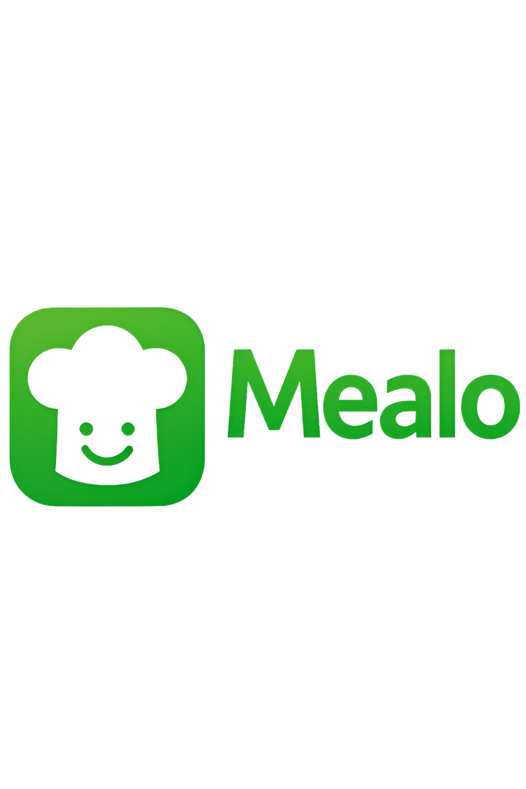
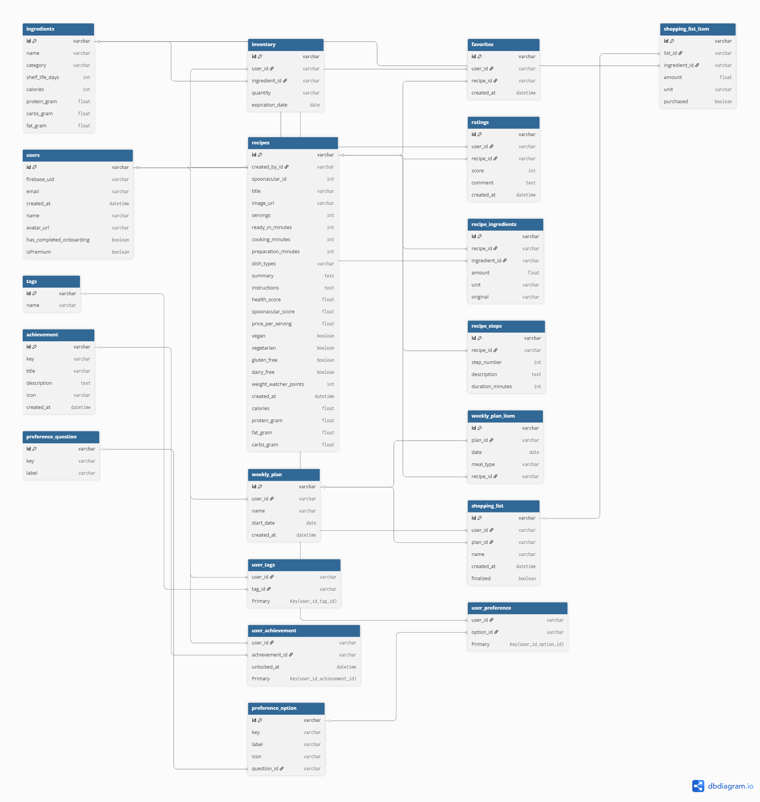

# Anforderungs- und Entwurfsspezifikation ("Pflichtenheft")
# 0 Titelseite




Danny Meihöfer - 1323212

Bjarne Zaremba - 1320828

[Link zum Source Code Repository](https://github.com/Mealo-Hsbi/Mealo)

# Inhaltsverzeichnis

- [1 Einführung](#1-Einführung)
  - [1.1 Beschreibung](#11-beschreibung)
- [2 Anforderungen](#2-anforderungen)
  - [2.1 Stakeholder](#21-stakeholder)
  - [2.2 Funktionale Anforderungen](#22-funktionale-anforderungen)
  - [2.3 Nicht-funktionale Anforderungen](#23-nicht-funktionale-anforderungen)
    - [2.3.1 Rahmenbedingungen](#231-rahmenbedingungen)
    - [2.3.2 Betriebsbedingungen](#232-betriebsbedingungen)
    - [2.3.3 Qualitätsmerkmale](#233-qualitätsmerkmale)
  - [2.4 Benutzergruppen & Personas](#24-benutzergruppen--personas)
  - [2.5 Wirtschaftlichkeitsbetrachtung](#25-wirtschaftlichkeitsbetrachtung)
  - [2.6 Graphische Benutzerschnittstelle](#24-graphische-benutzerschnittstelle)
  - [2.7 Anforderungen im Detail](#25-anforderungen-im-detail)
- [3 Technische Beschreibung](#3-technische-beschreibung)
  - [3.1 Systemübersicht](#31-systemübersicht)
  - [3.2 Softwarearchitektur](#32-softwarearchitektur)
    - [3.2.1 Technologieauswahl](#321-technologieauswahl)
  - [3.3 Schnittstellen](#33-schnittstellen)
    - [3.3.1 Externe Schnittstellen](#331-externe-schnittstellen)
    - [3.3.2 Interne Schnittstellen](#332-interne-schnittstellen)
  - [3.4 Datenmodell](#34-datenmodell)
  - [3.5 Abläufe (Workflows / Prozesse)](#35-abläufe-workflows-prozesse)
  - [3.6 Entwurf (Design / Design-Entscheidungen)](#36-entwurf-design-design-entscheidungen)
  - [3.7 Fehlerbehandlung](#37-fehlerbehandlung)
  - [3.8 Validierung](#38-validierung)
- [4 Projektorganisation](#4-projektorganisation)
  - [4.1 Annahmen](#41-annahmen)
  - [4.2 Verantwortlichkeiten](#42-verantwortlichkeiten)
  - [4.3 Grober Projektplan](#43-grober-projektplan)
- [5 Anhänge](#5-anhänge)
  - [5.1 Glossar](#51-glossar)
  - [5.2 Referenzen](#52-referenzen)
  - [5.3 Index](#53-index)


# 1 Einführung [ ](#inhaltsverzeichnis)


## 1.1 Beschreibung [ ](#inhaltsverzeichnis)

**Mealo** ist dein smarter Küchenbegleiter – eine mobile App, die dich nicht nur bei der Rezeptsuche unterstützt, sondern dich wie ein virtueller Koch an der Seite durch deinen kulinarischen Alltag führt.  

Im Zentrum steht eine intelligente Zutatenerkennung: Du kannst vorhandene Lebensmittel einfach einscannen – per Kamera, Barcode oder manueller Eingabe – und bekommst sofort passende Rezeptvorschläge, die deine Vorräte optimal nutzen. Doch Mealo kann weit mehr als das.

Die App bietet eine Vielzahl nützlicher Funktionen:  
- **Individuelle Filteroptionen** nach Zeitaufwand, Ernährungsform (z. B. vegan, glutenfrei), Schwierigkeitsgrad oder vorhandenen Küchengeräten  
- **Zutaten-Erkennung**: Fotografiere deine Zutaten und erhalte passende Rezepte
- **Kalorien- und Nährwertübersicht** für jedes Rezept – für alle, die bewusst kochen oder sportliche Ziele verfolgen  
- **Einkaufslistenfunktion** für fehlende Zutaten, direkt aus dem Rezept heraus generierbar  
- **Food-Waste-Vermeidung** durch clevere Resteverwertung und Fokus auf vorhandene Lebensmittel  
- **Intelligente Wochenplanung**: Auf Basis deiner Ziele, Vorlieben und Vorräte erstellt Mealo automatisch einen wöchentlichen Essensplan – samt Rezepte, Einkaufsliste und Kalorienübersicht
- **Geführtes Kochen**: Schritt-für-Schritt-Anleitungen, bei denen der Nutzer von der App durch den gesamten Kochprozess begleitet wird, inklusive integrierter Timer 
- **Community & Inspiration**: Nutzer können eigene Rezepte posten, die anderer entdecken und bewerten - für noch mehr kulinarische Vielfalt.

Und noch mehr.

Mealo richtet sich an alle, die gesünder, effizienter oder kreativer kochen möchten – vom Studierenden mit leerem Kühlschrank bis hin zum Fitness-Fan mit Meal-Prep-Plan. Die App ersetzt kein Kochbuch, sondern bietet das Wissen eines erfahrenen Kochs – in digitaler, interaktiver Form.  

Ob spontane Idee oder gezielte Planung: Mealo bringt Intelligenz, Inspiration und Nachhaltigkeit auf den Teller.

Ein Koch in deiner Hosentasche.

---

# 2 Anforderungen [ ](#inhaltsverzeichnis)

In diesem Abschnitt werden die funktionalen und nicht-funktionalen Anforderungen an das System Mealo systematisch erfasst. Ziel ist es, die Erwartungen und Bedürfnisse aller Beteiligten – insbesondere der Endnutzer – zu verstehen und in konkrete Anforderungen zu übersetzen. Die Anforderungen bilden die Grundlage für die spätere Systemarchitektur, die Umsetzung sowie für Tests und Abnahmen. Dabei wird sowohl auf die Stakeholder eingegangen als auch auf die konkreten Funktionen und Qualitätsmerkmale, die die Anwendung erfüllen soll.

---

## 2.1 Stakeholder [ ](#inhaltsverzeichnis)

| Funktion / Relevanz | Name | Kontakt / Verfügbarkeit | Wissen | Interessen / Ziele |
|---|---|---|---|---|
| Full-Stack Entwickler | Danny Meihöfer | danny.meihoefer@hsbi.de |  Technische Umsetzung und Organisation | Entwicklung einer funktionalen und kreativen App, Praxiserfahrung sammeln |
| Full-Stack Entwickler | Bjarne Zaremba | bjarne_linus.zaremba@hsbi.de | Technische Umsetzung und Organisation  | Technisch saubere Umsetzung, praxisnahe Anwendung entwickeln |
| Endnutzer (Zielgruppe), Einfluss auf Nutzerakzeptanz | Breite Nutzerschaft (z. B. Studierende, Berufstätige, Kochinteressierte) | indirekt über Umfragen, Feedback und Tests erreichbar | Kennt Alltagsprobleme rund ums Kochen, Einkaufen und Planen | Vereinfachung des Kochalltags, smarte Vorschläge, Zeit- und Ressourcenersparnis |
| Projektbetreuer (Dozent) | Prof. Dr. Jörg Brunsmann | über Hochschul-Mail erreichbar | Betreuung des Projekts im Rahmen der Lehrveranstaltung, methodische Unterstützung | Didaktisch strukturierter Projektverlauf, Zielerreichung und Dokumentation |

---

## 2.2 Funktionale Anforderungen [ ](#inhaltsverzeichnis)

Die folgende Liste beschreibt die funktionalen Anforderungen an die Anwendung *Mealo*. Sie ergeben sich aus der Zielsetzung der App und den geplanten Features. Die Anforderungen sind in thematische Gruppen unterteilt, um eine bessere Übersichtlichkeit zu gewährleisten.

### Akteure
- **Nutzer**: Verwender der App, gibt Zutaten ein, erhält Rezepte, erstellt Pläne etc.
- **System**: Die App selbst, die Benutzerinteraktionen verarbeitet, Vorschläge berechnet, Daten speichert und darstellt.

---

### 1. Zutatenverwaltung
- **FA-1.1**: Der Nutzer kann Zutaten manuell eingeben.
- **FA-1.2**: Über ein Foto-Upload können mehrere Lebensmittel gleichzeitig automatisch erkannt und übernommen werden.
- **FA-1.3**: Der Nutzer kann Zutaten aus einer Liste löschen oder bearbeiten.
- **FA-1.4**: Die App speichert eingegebene Zutaten lokal und/oder in der Cloud.
- **FA-1.5**: Die App kann Lebensmitteln scannen und die entsprechenden Zutaten automatisch hinzufügen.
- **FA-1.6**: Die App kann sich die Zutaten merken und speichert:
  - Name
  - Menge
  - Kategorie (z. B. Obst, Gemüse, Fleisch, etc.)
- **FA-1.7**: Die App kann für bestimmte Zutaten prüfen, ob diese in nahegelegenen Supermärkten verfügbar sind (z. B. über eine Drittanbieter-Schnittstelle, wenn verfügbar).
- **FA-1.8**: Die App kann aktuelle Supermarktangebote durchsuchen und relevante Produkte basierend auf dem aktuellen Vorrat und dem Rezeptbedarf herausfiltern. Dabei werden nahliegende Supermärkte, Rabattaktionen und eventuell beworbene Produkte (Product Placements) berücksichtigt. Feature für die Zukunft.

---

### 2. Rezeptvorschläge
- **FA-2.1**: Die App schlägt dem Nutzer Rezepte vor, basierend auf den vorhandenen Zutaten.
- **FA-2.2**: Rezepte werden nach verschiedenen Kriterien filterbar sein (z. B. vegan, kalorienarm, schnell, Resteverwertung, Equipment).
- **FA-2.3**: Die App zeigt eine Bewertung und geschätzte Zubereitungszeit an.
- **FA-2.4**: Der Nutzer kann Rezepte als Favoriten speichern.

---

### 3. Wochenplanung & Einkauf
- **FA-3.1**: Der Nutzer kann Rezepte zu einem Wochenplan hinzufügen.
- **FA-3.2**: Basierend auf dem Wochenplan kann die App automatisch eine Einkaufsliste generieren.
- **FA-3.3**: Die Einkaufsliste kann manuell bearbeitet werden.
- **FA-3.4**: Die App kann Zutaten aus der Einkaufsliste nach dem Einkauf dem Vorrat hinzufügen.
- **FA-3.5**: Die App kann automatisch Rezepte für die Woche vorschlagen, basierend auf den Vorräten und Vorlieben des Nutzers.

---

### 4. Benutzerkonto & Datenhaltung
- **FA-4.1**: Der Nutzer kann ein Benutzerkonto erstellen und sich einloggen.
- **FA-4.2**: Die App speichert Nutzerdaten, Einstellungen und Historien benutzerbezogen.
- **FA-4.3**: Die App bietet die Möglichkeit, das Konto zu löschen und alle Daten zu entfernen.
- **FA-4.4**: Der Nutzer kann sein Profil verwalten, z. B. persönliche Daten und Präferenzen bearbeiten.

---

### 5. Geführtes Kochen

- **FA-5.1**: Die App führt den Nutzer Schritt für Schritt durch das Rezept, wobei jeder Schritt klar hervorgehoben und nach Bedarf detailliert angezeigt wird.
- **FA-5.2**: Für Prozesse, die eine bestimmte Zeit erfordern (z. B. Kochen, Backen), kann der Nutzer direkt einen Timer starten, der im Hintergrund weiterläuft.
- **FA-5.3**: Die App bietet Sprachsteuerung, sodass der Nutzer Befehle wie "Weiter", "Zurück", "Starte Timer" oder "Wie lange noch?" geben kann, ohne die Hände zu benutzen.
- **FA-5.4**: Ein akustisches oder visuelles Feedback erfolgt, wenn ein Timer abgelaufen ist, um den Nutzer zu informieren.
- **FA-5.5**: Der geführte Modus kann optional aktiviert werden, indem der Nutzer gefragt wird, ob er die Funktion für das jeweilige Rezept nutzen möchte.
- **FA-5.6**: Die App erlaubt das gleichzeitige Starten und Verwalten von mehreren Timern für verschiedene Prozesse, wenn dies im Rezept erforderlich ist.

---

### 6. Community & Rezept-Sharing
- **FA-6.1**: Nutzer können eigene Rezepte anlegen und veröffentlichen.
- **FA-6.2**: Nutzer können Rezepte von anderen entdecken, speichern oder bewerten.
- **FA-6.3**: Rezepte könnenm it Bildern, Zutaten, Nährweten und Zubereitungsschritten versehen werden.

### 7. Erweiterte Funktionen

- **FA-7.1**: Die App kann eine Kalorienübersicht basierend auf gewählten Rezepten anzeigen.
- **FA-7.2**: Die App kann Rezepte auf Basis von Fitness-Zielen (z. B. Muskelaufbau, Diät) filtern.
- **FA-7.3**: Die App merkt sich Nutzerpräferenzen und passt Vorschläge personalisiert an.
- **FA-7.4**: Die App kann Makroskopische Daten (z. B. Eiweiß, Kohlenhydrate, Fette) für Rezepte anzeigen und die des Nutzers trackbar machen.
- **FA-7.5**: Sprachsteuerung für die Eingabe von Zutaten und navigation durch Rezepte.

---

### 8. Achievements & Fortschritt
- **FA-8.1**: Der Nutzer kann für bestimmte Aktionen (z. B. Anzahl gekochter Rezepte, Nutzung von Features) Achievements/Fortschritte erhalten.
- **FA-8.2**: Die erreichten Achievements werden im Profil angezeigt.

---

## 2.3 Nicht-funktionale Anforderungen [ ](#inhaltsverzeichnis)

### 2.3.1 Rahmenbedingungen [ ](#inhaltsverzeichnis)

**Zielplattformen**:  
Die Anwendung wird primär als mobile App (Android) entwickelt.

**Programmiersprachen / Frameworks**:  
Es werden moderne App-Technologien verwendet (z. B. JavaScript/TypeScript, Dart, Flutter).

**Backend**:  
RESTful API mit Node.js als Backend-Technologie.

**Datenhaltung**:  
Nutzung einer Cloud-Datenbank (z. B. Firebase, Google Cloud, Spoonacular) für Nutzerkonten, Zutaten und Rezepte.

**Schnittstellen / APIs**:  
Externe APIs:
  - Spoonacular, Rezeptdaten und Nährwertinformationen.
  - OpenAI, für die Bildverarbeitung und Zutatenerkennung.

**Gerätevoraussetzungen**:  
Mindestvoraussetzung ist ein Smartphone mit Kamera und Internetzugang.

**Sprachunterstützung**:  
Primär Englisch, mittelfristig mehrsprachige Erweiterung geplant.

---

### 2.3.2 Betriebsbedingungen [ ](#inhaltsverzeichnis)

**Betriebsumgebung**:  
- **Server**: Cloud-Hosting-Dienste (Google Cloud).
- **Betriebssysteme**: Android 8.0+ für mobile Anwendungen. 

**Zugänglichkeit**:  
- **Internetverbindung**: Eine stabile Internetverbindung wird benötigt, insbesondere für API-Abfragen und Datenaktualisierungen.  
- **Offline-Modus**: Teilweise Nutzung offline möglich (z. B. auf Basis von lokal gespeicherten Daten).

---

### 2.3.3 Qualitätsmerkmale [ ](#inhaltsverzeichnis)

| Qualitätsmerkmal       | Sehr gut | Gut | Normal | Nicht relevant |
|------------------------|----------|-----|--------|----------------|
| **Zuverlässigkeit**    |          |     |        |                |
| Fehlertoleranz         | X        |     |        |                |
| Wiederherstellbarkeit  | X        |     |        |                |
| Ordnungsmäßigkeit      |          |     | X      |                |
| Richtigkeit            |          | X   |        |                |
| Konformität            |          |     | X      |                |
| **Benutzerfreundlichkeit** |      |     |        |                |
| Installierbarkeit      |          |     | X      |                |
| Verständlichkeit       | X        |     |        |                |
| Erlernbarkeit          |          | X   |        |                |
| Bedienbarkeit          | X        |     |        |                |
| **Performance**        |          |     |        |                |
| Zeitverhalten          |          |     | X      |                |
| Effizienz              |          |     |        | X              |
| **Sicherheit**         |          |     |        |                |
| Analysierbarkeit       | X        |     |        |                |
| Modifizierbarkeit      |          |     | X      |                |
| Stabilität             | X        |     |        |                |
| Prüfbarkeit            | X        |     |        |                |

---

## 2.4 Benutzergruppen & Personas [ ](#inhaltsverzeichnis)

Die Benutzergruppe von Mealo ist heterogen, aber vereint durch ein gemeinsames Ziel: einfacher, effizienter und bewusster kochen. Die App richtet sich primär an Privatpersonen, die regelmäßig oder gelegentlich kochen und ihren Alltag durch digitale Unterstützung vereinfachen wollen. Dabei spielen Aspekte wie Resteverwertung, Zeitmanagement, Ernährungskontrolle und Inspiration eine zentrale Rolle.

Um die verschiedenen Bedürfnisse und Nutzungsszenarien besser zu verstehen und darauf abgestimmte Funktionalitäten sowie Monetarisierungsstrategien zu entwickeln, wurden exemplarisch drei Personas definiert:

---

### 👩‍🎓 Persona 1: Lisa – Die ressourcenbewusste Studentin

- **Alter:** 23 Jahre  
- **Lebenssituation:** Lebt in einer WG, studiert BWL  
- **Technikaffinität:** Hoch – nutzt regelmäßig Apps für Alltag & Studium  
- **Kochverhalten:** Improvisiert oft mit dem, was im Kühlschrank ist  
- **Ziele:** Günstig kochen, Lebensmittel nicht verschwenden, Zeit sparen  
- **Nutzung von Mealo:**  
  - Zutaten-Scan zur Resteverwertung  
  - Rezepte nach Aufwand & Verfügbarkeit filtern  
  - einfache Einkaufsliste für spontane Einkäufe  
- **Zahlungsbereitschaft:** Gering – nutzt vor allem Free-Version

---

### 👨‍💻 Persona 2: Tom – Der berufstätige Planer

- **Alter:** 34 Jahre  
- **Lebenssituation:** Lebt allein, arbeitet im IT-Support  
- **Technikaffinität:** Sehr hoch – organisiert viel digital  
- **Kochverhalten:** Möchte bewusst und geplant kochen  
- **Ziele:** Wochenplanung, Zeit sparen, gesund essen  
- **Nutzung von Mealo:**  
  - Wochenplaner und Einkaufsliste  
  - Kalorienangaben & Rezeptfilter nach Diät  
  - Favoritenverwaltung für wiederkehrende Gerichte  
- **Zahlungsbereitschaft:** Mittel bis hoch – nutzt Premium regelmäßig

---

### 🏋️‍♀️ Persona 3: Sophie – Die sportlich Ambitionierte

- **Alter:** 28 Jahre  
- **Lebenssituation:** Lebt mit Partner, macht aktiv CrossFit  
- **Technikaffinität:** Hoch – nutzt Fitness-Apps & Trackingsysteme  
- **Kochverhalten:** Plant gezielt nach Makros, macht Meal Prep  
- **Ziele:** Muskelaufbau, ausgewogene Ernährung, Tracking  
- **Nutzung von Mealo:**  
  - Rezepte nach Kalorien & Makros filtern  
  - Kombination mit Wochenplanung & Einkauf  
  - Nutzung der Community zur Rezept-Inspiration  
- **Zahlungsbereitschaft:** Hoch – nutzt Premium-Funktionen intensiv

---

Diese Personas helfen dabei, Funktionen gezielt zu priorisieren und die App auf reale Nutzungsbedürfnisse abzustimmen. Sie dienen außerdem als Grundlage für die Wirtschaftlichkeitsbetrachtung des geplanten Freemium-Modells.

## 2.5 Wirtschaftlichkeitsbetrachtung [ ](#inhaltsverzeichnis)

Die App *Mealo* wird im Rahmen eines **Freemium-Modells** betrieben. Ziel dieser Betrachtung ist es, den monatlichen Mindestumsatz zu berechnen, um die laufenden Infrastrukturkosten zu decken (Break-even).

---

### 2.5.1 Monetarisierungsstrategie

**Modell:**  
- **Free-Version (0 €)**: Basisfunktionen (Zutaten-Scan (Begrenzt), Rezeptsuche)  
- **Premium-Version (3,99 €/Monat)**:  
  - Werbefreiheit
  - Unbegrenzte Zutaten-Scan

**Zahlungsbereitschaft basiert auf Personas (siehe Kapitel 2.4):**
- Lisa (Free)
- Tom (Premium-Nutzer)
- Sophie (intensiver Premium-Nutzer)

---

### 2.5.2 Infrastrukturkosten (realistische Schätzung mit Cloud-Preisen)

| Kategorie                        | Dienst                       | Preisstruktur                         | Geschätzt/Monat |
|----------------------------------|-------------------------------|----------------------------------------|-----------------|
| **Server/Backend**               | Google Cloud (VM/Serverless)  | z. B. e2-medium, 0,034$/h → ~25$/Monat | ~23 €           |
| **Bilderkennung**                | OpenAI Vision API             | z. B. 0,0075 $/Bild (1.000 Bilder = 7,50 $) | **10.000 Bilder** = 75 € |
| **Rezeptdaten & Nährwerte**      | Spoonacular API               | z. B. 29 $/Monat (Standardplan, bis 150 Anfragen/Tag) | ~27 €           |
| **Datenbank (PostgreSQL/Firebase)** | Cloud SQL / Firestore      | ca. 10–15 GB + 2 vCPUs                 | ~35 €/Monat     |
| **Storage & Netzwerk**           | Cloud Storage + Traffic      | geschätzt                              | ~5–10 €         |
| **Gesamtkosten geschätzt**       |                               |                                        | **~170 € / Monat** |

---

### 2.5.3 Break-even-Berechnung

> **Hinweis:** Neben den Premium-Einnahmen werden auch Werbeeinnahmen aus der Free-Version berücksichtigt. Es wird angenommen, dass pro Free-Nutzer und Monat im Schnitt ca. 0,30 € durch Werbeeinblendungen (z. B. alle paar Rezepte) erzielt werden.

| Parameter                      | Wert                          |
|--------------------------------|-------------------------------|
| **Monatlicher Premiumpreis**  | 3,99 €                        |
| **Fixkosten (gesamt)**        | ~170 €                        |
| **Erwartete Premium-Quote**   | 5 %                           |
| **Werbeerlös pro Free-Nutzer**| 0,30 €                        |
| **Benötigte zahlende Nutzer** | 170 € / 3,99 € ≈ **43 Nutzer** |
| **Aktive Nutzer gesamt**      | 43 / 0,05 = **860 MAU**       |
| **Werbeerlös bei 860 MAU**    | 817 Free-Nutzer × 0,30 € ≈ 245 € |
| **Gesamterlös bei 860 MAU**   | (43 × 3,99 €) + 245 € ≈ 417 € |

> **Fazit:** Durch die zusätzlichen Werbeeinnahmen kann der Break-even bereits mit weniger Premium-Nutzern oder einer geringeren Gesamt-Nutzerzahl erreicht werden. Die tatsächliche Schwelle hängt von der realen Werbeauslastung und den erzielten CPM-Werten ab.

---

### 2.5.4 Monetarisierungspotenzial (Skalierung)

- **Werbeeinblendungen:** Einnahmen durch Banner, Interstitials oder Native Ads in der Free-Version. Die Werbeintensität kann je nach Nutzerverhalten oder App-Bereich variiert werden.
- **In-App-Käufe:** Themenpakete (z. B. "Low Carb", "Meal Prep für 2 Personen")
- **Product Placement:** Platzierte Markenprodukte bei Zutatenvorschlägen
- **Partnerangebote & Affiliate-Programme:** Integration von Supermarkt- oder Lieferdiensten, Affiliate-Links für Zutatenbestellungen, exklusive Coupons
- **Community-Boosts:** Z. B. "Rezept des Tages"-Platzierung gegen Gebühr, Premium-Kommentare, eigene Challenges erstellen
- **Premium+ Pakete:** Offline-Modus, Exportfunktionen, mehr Community-Rechte
- **Familien- und Business-Accounts:** Gemeinsame Planung, geteilte Einkaufsliste, spezielle Lizenzen für Ernährungsberater, Fitnessstudios oder Kochschulen
- **Datenbasierte Monetarisierung (optional, DSGVO-konform):** Anonymisierte Auswertung von Food-Trends und Nutzungsverhalten

> **Hinweis:** Die Monetarisierungsstrategie kann im laufenden Betrieb flexibel angepasst werden, um auf Nutzerfeedback, Markttrends und neue technische Möglichkeiten zu reagieren.

---

### Fazit

Mealo lässt sich mit einer aktiven Nutzerbasis von etwa **860 monatlich aktiven Nutzern** wirtschaftlich betreiben. Die technische Infrastruktur (inkl. PostgreSQL-Datenbank und Google Vision API) verursacht zwar reale Kosten, bleibt aber im Rahmen eines schlanken MVP. Mit gezielten Premium-Features, klarem Mehrwert und Community-Einbindung ist eine schrittweise Monetarisierung realistisch.


## 2.6 Graphische Benutzerschnittstelle [ ](#inhaltsverzeichnis)

Die grafische Benutzeroberfläche (GUI) von Mealo wird intuitiv und benutzerfreundlich gestaltet. Sie soll den Nutzer durch klare Strukturen und ansprechendes Design unterstützen. Die App wird in einem modernen, minimalistischen Stil gehalten, um Ablenkungen zu vermeiden und den Fokus auf die Inhalte zu legen.


## 🧾 **2.7 Anforderungen im Detail** [ ](#inhaltsverzeichnis)

### 📦 Zutatenverwaltung

| **Name**       | **In meiner Rolle als** | **möchte ich**                                 | **so dass**                                       | **Erfüllt, wenn**                                                | **Priorität** |
|----------------|--------------------------|--------------------------------------------------|--------------------------------------------------|------------------------------------------------------------------|---------------|
| Zutaten manuell | Nutzer                  | Zutaten manuell eingeben können                 | ich meine Vorräte auch ohne Scanner verwalten kann | ich neue Zutaten mit Name, Menge und Kategorie speichern kann     | Must          |
| Zutaten bearbeiten | Nutzer               | bestehende Zutaten bearbeiten oder löschen können | ich meine Vorräte aktuell halten kann             | ich Zutaten in der Liste auswählen, ändern oder entfernen kann    | Must          |
| Zutat erkennen | Nutzer                  | Zutaten per Bild oder Barcode hinzufügen können  | ich weniger tippen muss und schneller bin         | Zutaten über Kamera erkannt oder per Barcode ergänzt werden       | Must          |

---

### 🍽️ Rezeptvorschläge & Suche [ ](#inhaltsverzeichnis)

| **Name**       | **In meiner Rolle als** | **möchte ich**                                           | **so dass**                                      | **Erfüllt, wenn**                                                       | **Priorität** |
|----------------|--------------------------|------------------------------------------------------------|--------------------------------------------------|-------------------------------------------------------------------------|---------------|
| Rezepte finden | Nutzer                  | Rezepte zu meinen vorhandenen Zutaten vorgeschlagen bekommen | ich gezielt mit Resten kochen kann               | passende Rezepte angezeigt werden, basierend auf gespeicherten Zutaten | Must          |
| Rezept filtern | Nutzer                  | Rezepte nach Aufwand, Ernährungsform, etc. filtern können  | ich schneller passende Gerichte finde            | Filtereinstellungen angepasst und korrekt angewendet werden             | Should        |
| Gericht erkennen | Nutzer                | ein Gericht fotografieren können                           | ich herausfinden kann, was drin ist               | Hauptzutaten anhand des Fotos vorgeschlagen werden                     | Could         |

---

### 📆 Planung & Einkauf [ ](#inhaltsverzeichnis)

| **Name**       | **In meiner Rolle als** | **möchte ich**                                         | **so dass**                                        | **Erfüllt, wenn**                                                  | **Priorität** |
|----------------|--------------------------|----------------------------------------------------------|---------------------------------------------------|--------------------------------------------------------------------|---------------|
| Einkaufsliste  | Nutzer                  | fehlende Zutaten in eine Einkaufsliste übernehmen können | ich beim Einkaufen nichts vergesse                | Zutaten aus Rezepten automatisch in einer Liste ergänzt werden     | Should        |
| Wochenplan     | Nutzer                  | einen Wochenplan basierend auf Vorlieben erstellen lassen | ich die Woche besser vorbereiten kann             | automatisch generierte Tagespläne mit Rezepten angezeigt werden    | Could         |

---

### 👨‍🍳 Kochassistenz & Anleitung [ ](#inhaltsverzeichnis)

| **Name**       | **In meiner Rolle als** | **möchte ich**                                                        | **so dass**                                        | **Erfüllt, wenn**                                                    | **Priorität** |
|----------------|--------------------------|------------------------------------------------------------------------|---------------------------------------------------|----------------------------------------------------------------------|---------------|
| Schrittweise kochen | Nutzer             | Schritt-für-Schritt durch Rezepte geführt werden                       | ich nicht den Überblick verliere                  | nur der aktuelle Schritt sichtbar ist und ggf. mit Timer ergänzt wird | Must          |
| Timer + Sprachsteuerung | Nutzer         | Timer direkt im Rezept starten und mit Sprache steuern können          | ich beim Kochen nicht mein Handy anfassen muss    | Timer per Klick oder Sprachbefehl gestartet/gestoppt werden können    | Could         |

---

### 🔐 Nutzerkonto & Authentifizierung [ ](#inhaltsverzeichnis)

| **Name**       | **In meiner Rolle als** | **möchte ich**                                | **so dass**                                    | **Erfüllt, wenn**                                                  | **Priorität** |
|----------------|--------------------------|-----------------------------------------------|------------------------------------------------|--------------------------------------------------------------------|---------------|
| Anmeldung      | Nutzer                  | mich registrieren und anmelden können         | meine Daten personalisiert gespeichert werden  | Registrierung via E-Mail oder Google/Firebase funktioniert         | Must          |
| Cloud-Sync     | Nutzer                  | meine Zutaten und Favoriten in der Cloud sichern | ich bei Gerätewechsel nichts verliere         | Nach Anmeldung sind Daten automatisch synchronisiert                | Must          |

---

### 🏳️ Mehrsprachigkeit [ ](#inhaltsverzeichnis)

| **Name**       | **In meiner Rolle als** | **möchte ich**                                  | **so dass**                                    | **Erfüllt, wenn**                                                  | **Priorität** |
|----------------|--------------------------|--------------------------------------------------|------------------------------------------------|--------------------------------------------------------------------|---------------|
| Sprache wählen | Nutzer                  | zwischen Sprachen (z. B. Englisch/Deutsch) wechseln können | ich die App in meiner bevorzugten Sprache nutzen kann | UI-Texte passen sich je nach Spracheinstellung an                   | Could         |

---

### 🌐 Offline-Funktionalität [ ](#inhaltsverzeichnis)

| **Name**       | **In meiner Rolle als** | **möchte ich**                                     | **so dass**                                    | **Erfüllt, wenn**                                                  | **Priorität** |
|----------------|--------------------------|----------------------------------------------------|------------------------------------------------|--------------------------------------------------------------------|---------------|
| Offline-Zutaten | Nutzer                 | meine gespeicherten Zutaten auch offline einsehen können | ich z. B. im Supermarkt Zugriff darauf habe   | Die Zutatenliste ist lokal verfügbar, auch ohne Internetverbindung  | Should         |

---

### ⭐ Favoriten & Verlauf [ ](#inhaltsverzeichnis)

| **Name**       | **In meiner Rolle als** | **möchte ich**                               | **so dass**                                     | **Erfüllt, wenn**                                                  | **Priorität** |
|----------------|--------------------------|----------------------------------------------|-------------------------------------------------|--------------------------------------------------------------------|---------------|
| Rezepte merken | Nutzer                  | Rezepte zu meinen Favoriten hinzufügen können | ich Lieblingsrezepte schnell wieder finde      | Favorisierte Rezepte erscheinen in einem separaten Bereich         | Should         |
| Rezeptverlauf  | Nutzer                  | kürzlich aufgerufene Rezepte wiederfinden können | ich nicht erneut suchen muss                   | Die letzten X geöffneten Rezepte werden automatisch gespeichert     | Could          |

---

### 🧮 Nährwertinfos & Kalorien [ ](#inhaltsverzeichnis)

| **Name**       | **In meiner Rolle als** | **möchte ich**                                         | **so dass**                                   | **Erfüllt, wenn**                                                  | **Priorität** |
|----------------|--------------------------|----------------------------------------------------------|-----------------------------------------------|--------------------------------------------------------------------|---------------|
| Nährwertübersicht | Nutzer               | die Kalorien und Nährwerte eines Rezepts sehen können   | ich bewusst essen und planen kann             | kcal, Fett, Protein, Kohlenhydrate etc. werden pro Portion angezeigt | Should         |

---

### 🏆 Achievements & Fortschritt [ ](#inhaltsverzeichnis)

| **Name**         | **In meiner Rolle als** | **möchte ich**                                                      | **so dass**                                         | **Erfüllt, wenn**                                                      | **Priorität** |
|------------------|------------------------|---------------------------------------------------------------------|-----------------------------------------------------|------------------------------------------------------------------------|---------------|
| Achievements     | Nutzer                 | für bestimmte Aktionen Auszeichnungen/Fortschritte erhalten         | ich motiviert werde, die App regelmäßig zu nutzen   | nach Aktionen wie "X Rezepte gekocht" ein Achievement angezeigt wird   | Could         |
| Achievement-Übersicht | Nutzer             | meine erreichten Achievements im Profil einsehen können             | ich meinen Fortschritt nachvollziehen kann           | eine Übersicht aller erreichten Achievements im Profil sichtbar ist     | Could         |

---

# 3 Technische Beschreibung [ ](#inhaltsverzeichnis)
## 3.1 Systemübersicht [ ](#inhaltsverzeichnis)


## 3.2 Softwarearchitektur [ ](#inhaltsverzeichnis)

Die Softwarearchitektur von Mealo folgt dem klassischen **Client-Server-Modell**. Die Anwendung besteht aus zwei Hauptkomponenten: einer **mobilen App** (Client), entwickelt mit Flutter, und einem **Backend-Server** auf Basis von Node.js, der über eine REST-API mit der App kommuniziert. Zusätzlich werden externe Dienste wie OpenAI (für Bilderkennung) und Spoonacular (für Rezepte und Nährwertdaten) angebunden.

### Client (Frontend)

Die mobile App ist in **Flutter (Dart)** entwickelt und in folgende Schichten unterteilt:

- **View-Schicht**: Präsentiert die Benutzeroberfläche. Hier befinden sich Widgets und Layouts zur Anzeige und Interaktion mit Zutaten, Rezepten, Profilen und weiteren Funktionen.
- **Logik-Schicht**: Beinhaltet Geschäftslogik wie das Verarbeiten von Nutzeraktionen, das Vorverarbeiten von Daten für die Anzeige, das Erkennen von Zutaten durch Bilderkennung und das Auslösen von API-Anfragen.
- **Kommunikations-Schicht**: Verwaltet die REST-Kommunikation mit dem Backend (z. B. über die `http`-Bibliothek) und ggf. direkte Anbindung von externen APIs.

Die App ist modular nach Features aufgebaut (z. B. Authentifizierung, Rezeptsuche, Kamera/Bilderkennung, Mealplan, Favoriten, Profilverwaltung) und folgt Clean Architecture-Prinzipien.

### Server (Backend)

Das Backend ist als Webserver mit einer REST-Schnittstelle auf Basis von **Node.js** und **Express.js** aufgebaut. Es gliedert sich in:

- **Web-Schicht**: Nimmt HTTP-Anfragen entgegen, verarbeitet sie und gibt HTTP-Antworten zurück. Sie stellt die Schnittstelle zur mobilen App dar.
- **Logik-Schicht**: Enthält die zentrale Anwendungslogik des Servers. Dazu gehören z. B. die Verarbeitung von Rezeptanfragen, Verwaltung von Nutzerprofilen, Achievements, Favoriten und die Integration externer APIs.
- **Persistenz-Schicht**: Verwaltet die Datenbankzugriffe (z. B. PostgreSQL via Prisma ORM oder Firestore). Hier werden Nutzerprofile, Zutatenlisten, Rezepte, Mealplans und Achievements gespeichert.

### Externe Dienste

- **OpenAI Vision API**: Für die cloudbasierte Bilderkennung von Zutatenfotos.
- **Spoonacular API**: Für die Abfrage und Anreicherung von Rezeptdaten und Nährwertinformationen.
- **Firebase**: Für Authentifizierung und ggf. Cloud-Datenhaltung.

Die Kommunikation zwischen den Komponenten erfolgt standardisiert über **HTTP mit JSON** als Datenformat. Die Abhängigkeiten der Schichten verlaufen einheitlich von oben nach unten, wodurch eine klare Trennung von Darstellung, Logik und Persistenz sichergestellt wird.

---

### 3.2.1 Technologieauswahl [ ](#inhaltsverzeichnis)

In der folgenden Tabelle sind die aktuell verwendeten Technologien und Frameworks für die Entwicklung der App aufgeführt. Die Auswahl basiert auf den Anforderungen der Anwendung, wie der plattformübergreifenden Entwicklung, der Nutzung von Cloud-Diensten für Hosting und Datenmanagement sowie der Integration von KI-gestützter Bilderkennung und externer Rezeptdaten. Es werden nur wichtige und "besondere" Technologien aufgelistet.

| **Technologie**               | **Beschreibung**                                                                                       |
|-------------------------------|--------------------------------------------------------------------------------------------------------|
| **Flutter**                    | Framework für plattformübergreifende App-Entwicklung (Android) mit einer einheitlichen Codebasis.      |
| **Dart**                       | Programmiersprache für die Entwicklung mit Flutter, bietet hohe Performance und Flexibilität.           |
| **Node.js**                    | JavaScript-Laufzeitumgebung für das Backend, RESTful API mit Express.js.                               |
| **Prisma**                     | ORM für Node.js zur Verwaltung der PostgreSQL-Datenbank.                                               |
| **Firebase**                   | Authentifizierung und ggf. Cloud-Datenhaltung.                                                         |
| **OpenAI Vision API**          | Cloudbasierte KI-Bilderkennung für Zutatenfotos.                                                       |
| **Spoonacular API**            | Externe API für Rezepte und Nährwertinformationen.                                                     |
| **REST API**                   | Kommunikation zwischen Frontend und Backend über RESTful API-Endpunkte.                                |
| **http (Dart)**                | Bibliothek zur Durchführung von HTTP-Anfragen im Frontend zur Kommunikation mit der API.               |
| **JSON**                       | Datenformat für die Kommunikation zwischen Client und Server.                                          |
| **Provider**                   | State-Management-Lösung für Flutter, um den Zustand der App zu verwalten.                              |
| **Flutter Image Picker**       | Bibliothek zum Auswählen und Hochladen von Bildern aus der Galerie oder mit der Kamera.                |

---

### 3.2.2 Projekt- und Ordnerstruktur

Die App *Mealo* wird als **Monorepo** verwaltet, das sowohl die mobile Flutter-Anwendung (Frontend) als auch den Node.js-Server (Backend) in einem gemeinsamen Repository beherbergt. Diese Struktur fördert die Code-Wiederverwendung und vereinfacht die Verwaltung von Abhängigkeiten und Build-Prozessen. Im Folgenden wird die logische Ordnerstruktur des Projekts erläutert.

**Top-Level-Struktur des Monorepos:**

```
mealo-project/
├── backend/            # Enthält den Node.js-Server
├── frontend/           # Enthält die Flutter-Anwendung
├── docs/               # Dokumentationsdateien (wie dieses Pflichtenheft)
├── .gitignore          # Git-Ignorier-Regeln
├── README.md           # Haupt-Readme des Projekts
└── ... (weitere gemeinsame Konfigurationsdateien)
```

#### Frontend-Struktur (`frontend/`)

Das Frontend wird mit Flutter und Dart entwickelt und bietet eine plattformübergreifende mobile Erfahrung. Es interagiert mit dem Backend über REST APIs und bietet eine moderne, benutzerfreundliche Oberfläche. Die Frontend-Architektur ist in feature-basierte Module organisiert, die jeweils einen Kernbereich der App abdecken.

**Hauptmodule und Verzeichnisstruktur:**

```
frontend/
├── lib/
│   ├── features/         # Haupt-App-Features
│   │   ├── auth/         # Benutzerauthentifizierung (Login, Registrierung, Auth-Status)
│   │   ├── mealplan/     # Essensplan-Erstellung, -Bearbeitung und -Anzeige
│   │   ├── camera/       # Kamera-Integration und Bilderkennung für Zutaten
│   │   ├── profile/      # Benutzerprofil, Präferenzen und Einstellungen
│   │   ├── recipe/       # Rezept-Entdeckung, Suche und Details
│   │   ├── favorites/    # Verwaltung und Anzeige von Favoritenrezepten
│   │   ├── explore/      # Neue Rezepte und Essensideen entdecken
│   │   ├── onboarding/   # Benutzer-Onboarding-Flow
│   │   ├── search/       # Zutaten- und Rezeptsuchfunktion
│   │   ├── home/         # Startbildschirm/Dashboard
│   │   └── blub/         # (Benutzerdefiniertes Feature, z.B. Hotel-Listen-Demo)
│   ├── common/           # Gemeinsam genutzte Komponenten (Models, Stile, Utilities, wiederverwendbare Widgets)
│   │   ├── data/         # Statische Daten (z.B. ingredients.dart)
│   │   ├── models/       # Datenmodelle (z.B. ingredient.dart, recipe.dart)
│   │   ├── utils/        # Hilfsfunktionen (z.B. string_similarity_helper.dart)
│   │   └── widgets/      # Wiederverwendbare UI-Komponenten (z.B. ingredient_chip_row.dart, search_header.dart)
│   ├── core/             # App-weite Konfiguration, Konstanten, Fehlerbehandlung, Provider, Routing und Theming
│   │   ├── providers/    # App-weite Provider
│   ├── services/         # API-Clients und Netzwerkkonfiguration (z.B. api_client.dart)
│   └── main.dart         # Haupteinstiegspunkt der Flutter-App
├── assets/               # Statische Ressourcen (Bilder, Icons, Sounds)
├── test/                 # Frontend-Tests (für Screens, Repositories, Core-Logik)
├── pubspec.yaml          # Flutter-Projektmetadaten und Abhängigkeiten
├── README.md             # Readme für das Frontend-Projekt
└── ...
```

**Feature-Modul-Struktur: Clean Architecture**

**Feature-First-Ansatz:**
Die Organisation des Frontends folgt dem sogenannten "Feature-First"-Prinzip. Das bedeutet, dass der Code nicht nach technischen Schichten (z. B. alle Models, alle Services, alle Widgets), sondern nach Features bzw. Anwendungsbereichen strukturiert ist. Jedes Feature (wie Authentifizierung, Rezeptsuche, Kamera, Profil) enthält alle zugehörigen Komponenten (Datenquellen, Modelle, Use Cases, UI) in einem eigenen Verzeichnis. Das erleichtert die Wartung, fördert die Übersichtlichkeit und ermöglicht parallele Entwicklung an verschiedenen Features, ohne dass es zu Konflikten kommt. Jedes Feature im Verzeichnis `lib/features/` ist nach einem Clean Architecture-Ansatz organisiert und die Aufteilung der Verantwortlichkeiten wird aus den Verzeichnissen deutlich:

```
features/
  [feature_name]/  # z.B. recipe/, search/
    data/
      repositories/   # Implementierungen der Repository-Interfaces
      datasources/    # Datenquellen (z.B. API-Clients, lokale Datenbank)
    domain/
      models/         # Kern-Entitäten/Modelle für das Feature
      usecases/       # Anwendungsfälle (Business-Logik)
      repositories/   # Abstrakte Repository-Interfaces
    presentation/
      screens/        # Bildschirme/Seiten des Features
      providers/      # Feature-spezifische State-Management-Provider/Controller
      widgets/        # UI-Widgets, die spezifisch für das Feature sind
```

Diese Struktur gewährleistet:

  * **Trennung der Verantwortlichkeiten**: UI, Geschäftslogik und Datenzugriff sind unabhängig voneinander.
  * **Testbarkeit**: Jede Schicht kann isoliert getestet werden.
  * **Skalierbarkeit**: Neue Features oder Änderungen können mit minimalen Auswirkungen auf andere Schichten hinzugefügt werden.
  * **Wartbarkeit**: Code ist leichter zu verstehen, zu refaktorisieren und zu erweitern.

#### Backend-Struktur (`backend/`)

Das Backend ist mit Node.js und Express.js aufgebaut und nutzt Prisma als ORM für die Datenbankverwaltung. Es stellt RESTful APIs für das Frontend bereit und handhabt Authentifizierung, Essensplanungslogik, Bilderkennung und weitere serverseitige Prozesse.

**Hauptkomponenten und Verzeichnisstruktur:**

```
backend/
├── app/
│   ├── config/         # Konfigurationsdateien (z.B. apiKeys.js)
│   ├── controllers/    # Logik zur Verarbeitung von HTTP-Anfragen und Antworten
│   ├── middleware/     # Express-Middleware (z.B. für Authentifizierung, Validierung)
│   ├── models/         # Datenbank-Schema und ORM-Modelle
│   ├── routes/         # Definition der API-Endpunkte
│   ├── services/       # Geschäftslogik und Integration mit externen APIs (z.B. spoonacularService.js)
│   ├── prisma/         # Prisma-Schema-Definitionen
│   ├── firebase.js     # Firebase-Integration
│   └── prisma.js       # Prisma-Client-Setup
├── tests/              # Backend-Tests
├── Dockerfile          # Konfiguration für die Containerisierung
├── jest.config.js      # Jest-Testkonfiguration
├── package.json        # Projektmetadaten und Abhängigkeiten
├── server.js           # Hauptdatei zum Starten des Servers
└── ...
```

---


## 3.3 Schnittstellen [ ](#inhaltsverzeichnis)

Im Folgenden werden die wichtigsten Schnittstellen des Softwaresystems beschrieben. Dies umfasst sowohl die externen Schnittstellen, die die Kommunikation zwischen Client (App) und Server (Backend) sowie zu Drittanbietern ermöglichen, als auch die internen Schnittstellen zwischen den einzelnen Komponenten des Systems.

### 3.3.1 Externe Schnittstellen

Die zentrale externe Schnittstelle ist die **REST-API** zwischen der mobilen App (Flutter) und dem Backend (Node.js). Die Kommunikation erfolgt über HTTPS und JSON. Die wichtigsten Endpunkte sind:

- **Authentifizierung:**
  - `POST /users/register` – Registrierung eines neuen Nutzers
  - `POST /users/login` – Login und Token-Generierung
  - `POST /users/logout` – Logout
- **Zutatenverwaltung:**
  - `GET /ingredients` – Abruf der gespeicherten Zutaten des Nutzers
  - `POST /ingredients` – Hinzufügen neuer Zutaten (manuell oder per Bild)
  - `DELETE /ingredients/:id` – Löschen einer Zutat
  - `PUT /ingredients/:id` – Bearbeiten einer Zutat
- **Bilderkennung:**
  - `POST /image-recognition` – Hochladen eines Bildes zur Zutaten-Erkennung (Backend ruft OpenAI Vision API auf)
- **Rezeptvorschläge & Suche:**
  - `GET /recipes` – Rezepte basierend auf Zutaten abrufen (Backend ruft Spoonacular API auf)
  - `GET /recipes/:id` – Details zu einem Rezept abrufen
  - `POST /recipes/favorite` – Rezept als Favorit speichern
  - `GET /recipes/favorites` – Favoriten abrufen
- **Mealplan & Einkaufsliste:**
  - `GET /mealplan` – Aktuellen Wochenplan abrufen
  - `POST /mealplan` – Wochenplan erstellen/aktualisieren
  - `GET /shopping-list` – Einkaufsliste generieren
- **Achievements:**
  - `GET /achievements` – Erreichte Achievements abrufen
- **Profil:**
  - `GET /profile` – Profildaten abrufen
  - `PUT /profile` – Profildaten aktualisieren

**Drittanbieter-Schnittstellen (vom Backend aus):**
- **OpenAI Vision API:** Für die Analyse von hochgeladenen Bildern zur Zutaten-Erkennung.
- **Spoonacular API:** Für die Suche und Detailabfrage von Rezepten sowie Nährwertinformationen.
- **Firebase:** Für Authentifizierung und ggf. Cloud-Datenhaltung.

### 3.3.2 Interne Schnittstellen

Intern kommunizieren die Backend-Komponenten über Funktionsaufrufe und Service-Schichten. Wichtige interne Schnittstellen sind:
- **Service-Layer:** Vermittelt zwischen den API-Routen und der Datenbank/externen APIs (z. B. `recipeService`, `ingredientService`, `achievementService`).
- **ORM (Prisma):** Abstraktion für Datenbankzugriffe (CRUD auf Nutzer, Zutaten, Rezepte, Mealplans, Achievements etc.).
- **Event-System (optional):** Für bestimmte Aktionen (z. B. neues Achievement erreicht) können interne Events ausgelöst werden, die z. B. Benachrichtigungen oder Logging triggern.

---

### 3.3.1 Ereignisse [ ](#inhaltsverzeichnis)

Im System können verschiedene Ereignisse (Events) auftreten, die für interne Abläufe, Benachrichtigungen oder externe Integrationen genutzt werden. Beispiele für relevante Events:

- **Neues Achievement erreicht:**
  - Event wird ausgelöst, wenn ein Nutzer eine neue Auszeichnung erhält (z. B. "10 Rezepte gekocht").
  - Kann genutzt werden, um eine Benachrichtigung in der App anzuzeigen oder das Profil zu aktualisieren.
- **Zutat hinzugefügt/entfernt:**
  - Event für Logging, Analytics oder zur Aktualisierung von Vorschlägen.
- **Rezept als Favorit gespeichert:**
  - Event für Analytics oder zur Synchronisation mit Cloud/Favoritenliste.
- **Mealplan aktualisiert:**
  - Event für Erinnerungen oder zur Generierung einer neuen Einkaufsliste.

Events können im Backend als interne Nachrichten (z. B. via EventEmitter) oder als Push-Benachrichtigungen an den Client genutzt werden. Sie unterstützen die Erweiterbarkeit und ermöglichen zukünftige Integrationen (z. B. Webhooks, externe Benachrichtigungsdienste).

## 3.4 Datenmodell [ ](#inhaltsverzeichnis)

Das Datenmodell von *Mealo* bildet die zentrale Datenstruktur des Systems ab. Es orientiert sich an den Hauptobjekten der Anwendung: Nutzer:innen, Zutaten, Rezepte, Wochenpläne, Favoriten, Achievements, Präferenzen und deren Relationen. Die Datenhaltung erfolgt in einer relationalen PostgreSQL-Datenbank, modelliert mit Prisma ORM.

### 📌 Beschreibung der Tabellen (Prisma-Modelle)

| Tabelle/Modell           | Beschreibung |
|-------------------------|--------------|
| `users`                 | Enthält Nutzerprofile mit Firebase UID, Name, E-Mail, Avatar-URL, Onboarding- und Premium-Status. Verknüpft mit Favoriten, Inventar, Bewertungen, Rezepten, Wochenplänen, Achievements, Präferenzen und Tags. |
| `ingredients`           | Stammdaten zu Zutaten, einschließlich Name, Kategorie, Haltbarkeit (optional) und Nährwertangaben (Kalorien, Eiweiß, Kohlenhydrate, Fett). |
| `inventory`             | Repräsentiert die individuellen Vorräte eines Nutzers mit Mengenangabe und Haltbarkeitsdatum. |
| `recipes`               | Kernstück der App: Rezepttitel, Bilder, Beschreibung, Nährwerte, Allergene, Anleitungen, Ersteller-Relation sowie Bewertung, Favoriten und Zutatenverknüpfung. |
| `recipe_ingredients`    | Verknüpft Rezepte mit Zutaten inkl. Mengenangabe, Einheit und Originalbeschreibung. |
| `recipe_steps`          | Detaillierte Kochanleitungen mit Schritttext und optionaler Dauer in Minuten. |
| `favorites`             | Verknüpft Nutzer:innen mit ihren favorisierten Rezepten. |
| `ratings`               | Bewertungen (Score 1–5, optionaler Kommentar) zu Rezepten durch Nutzer. |
| `weekly_plan`           | Wochenplan eines Nutzers mit Startdatum, Name und Relationen zu Planpunkten und Einkaufsliste. |
| `weekly_plan_item`      | Einzelne Einträge eines Wochenplans mit Rezept, Datum und Mahlzeitentyp. |
| `shopping_list`         | Einkaufsliste eines Nutzers, optional zugeordnet zu einem Wochenplan. |
| `shopping_list_item`    | Einzelne Produkte in der Einkaufsliste, inkl. Zutat, Menge, Einheit, gekauft-Status. |
| `achievement`           | Alle möglichen Erfolge mit Schlüssel, Titel, Beschreibung und Icon. |
| `user_achievement`      | Erreichte Achievements eines Nutzers mit Zeitstempel. |
| `tags`                  | Von Nutzern vergebene Tags zur Kategorisierung. |
| `user_tags`             | Verknüpfungstabelle zwischen Nutzern und Tags. |
| `preference_question`   | Fragen zu Präferenzen, etwa Ernährung oder Unverträglichkeiten. |
| `preference_option`     | Mögliche Antwortoptionen zu einer Präferenzfrage. |
| `user_preference`       | Verknüpfung von Nutzer:innen mit gewählten Präferenzoptionen. |

---

### 🧬 Erweiterung: Makronährwerte

Zur Unterstützung gesundheitsorientierter Funktionen enthält das System präzise Nährwertangaben auf Zutaten- und Rezeptebene:

- `calories` – Kalorien in kcal
- `protein_gram` – Eiweiß in Gramm
- `carbs_gram` – Kohlenhydrate in Gramm
- `fat_gram` – Fett in Gramm

Diese Werte ermöglichen die gezielte Auswahl und Empfehlung von Rezepten basierend auf den individuellen Zielwerten.

---

### 📊 ER-Diagramm

Das folgende ER-Diagramm stellt die zentralen Entitäten und deren Relationen schematisch dar (basierend auf dem Prisma-Modell):



---

## 3.5 Abläufe (Workflows / Prozesse) [ ](#inhaltsverzeichnis)

In diesem Abschnitt werden zentrale dynamische Abläufe des Systems beschrieben. Im Fokus stehen die Interaktionen zwischen Client, Backend und externen APIs, die zur Erfüllung wichtiger funktionaler Anforderungen führen. Die Abläufe sind als Schritt-für-Schritt-Prozesse dargestellt und zeigen den Datenfluss im System.

### Beispiel 1: Zutaten-Scan und Rezeptvorschläge (FA-1.2 & FA-2.1)
1. Der Nutzer startet den Zutaten-Scan in der App.
2. Die App öffnet die Kamera und erfasst ein Bild der Zutaten.
3. Das Bild wird an das Backend gesendet (`POST /image-recognition`).
4. Das Backend ruft die OpenAI Vision API mit dem Bild auf.
5. Die OpenAI API gibt erkannte Zutaten (Liste von Texten) zurück.
6. Das Backend verarbeitet die erkannten Zutaten (Normalisierung, Abgleich mit interner Datenbank).
7. Das Backend ruft die Spoonacular API auf, um Rezepte basierend auf diesen Zutaten zu finden.
8. Die Spoonacular API gibt eine Liste von Rezepten zurück.
9. Das Backend transformiert die Spoonacular-Daten in das interne Rezeptmodell und fügt ggf. Metadaten (z.B. Anzahl passender/fehlender Zutaten) hinzu.
10. Das Backend sendet die Rezeptvorschläge an die App zurück.
11. Die App zeigt die Rezepte dem Nutzer an.

### Beispiel 2: Rezeptsuche mit Sortierung und Paginierung
1. Der Nutzer gibt einen Suchbegriff ein und/oder wählt Zutaten aus.
2. Der Nutzer wählt eine Sortieroption (z.B. "Zubereitungszeit kürzeste zuerst").
3. Die App sendet die Suchparameter (Query, Zutaten, Sortierkriterium, Sortierrichtung, Offset, Anzahl) an das Backend.
4. Das Backend ruft die Spoonacular API mit den entsprechenden Parametern auf (z.B. sort: 'time', sortDirection: 'asc').
5. Die Spoonacular API gibt die ersten X sortierten Rezepte zurück.
6. Das Backend transformiert die Daten und leitet sie an die App weiter.
7. Die App zeigt die sortierte Rezeptliste an.
8. Scrollt der Nutzer ans Listenende, erhöht die App den Offset und sendet eine weitere Anfrage, um die nächste Seite zu laden.
9. Das Backend wiederholt den Prozess und liefert weitere sortierte Rezepte.

### Beispiel 3: Geführter Kochmodus mit Timer
1. Der Nutzer wählt ein Rezept und startet den geführten Kochmodus.
2. Die App zeigt den ersten Zubereitungsschritt an.
3. Der Nutzer kann per Button (oder ggf. Spracheingabe) zum nächsten/vorherigen Schritt navigieren.
4. Bei Schritten mit Zeitangabe kann der Nutzer einen Timer starten.
5. Die App verwaltet die Timer und zeigt Fortschritt/Restzeit an.
6. Nach Ablauf eines Timers erhält der Nutzer eine Benachrichtigung (visuell/akustisch).
7. Nach Abschluss aller Schritte wird der Kochmodus beendet und ggf. ein Achievement ausgelöst.

---

## 3.6 Entwurf (Design / Design-Entscheidungen) [ ](#inhaltsverzeichnis)

In diesem Abschnitt werden die zentralen Design-Entscheidungen, Muster und Begründungen für die Architektur und Implementierung von Mealo erläutert.

### Architekturmuster

**Frontend (Flutter):**
- Die App folgt dem Clean Architecture-Prinzip mit klarer Trennung in Presentation, Domain und Data Layers.
- **Presentation Layer:** Enthält UI, Provider/State-Management und Interaktionslogik.
- **Domain Layer:** Definiert Use Cases (z.B. "Suche Rezepte", "Füge Zutat hinzu") und zentrale Entitäten/Modelle. Die Use Cases kapseln die Geschäftslogik und sind unabhängig von Datenquellen.
- **Data Layer:** Implementiert Repositories, die Daten aus externen APIs (Spoonacular, OpenAI), lokalen Quellen oder dem Backend beziehen. Repositories abstrahieren die Datenquellen und ermöglichen einfache Testbarkeit.
- **Begründung:** Clean Architecture wurde gewählt, um Testbarkeit, Wartbarkeit und Skalierbarkeit zu gewährleisten. Feature-Module können unabhängig entwickelt und getestet werden.

**Backend (Node.js/Express):**
- Das Backend folgt einem MVC-ähnlichen Muster mit klarer Trennung in Controller (API-Endpoints), Services (Geschäftslogik, externe API-Integration) und Models (Prisma-ORM).
- **Begründung:** Diese Struktur ermöglicht eine saubere Trennung von Verantwortlichkeiten, erleichtert das Testen und die Erweiterung um neue Features.

### API-Design-Prinzipien
- Die REST-API ist zustandslos, ressourcenbasiert und verwendet standardisierte HTTP-Methoden (GET, POST, PUT, DELETE).
- Fehler werden konsistent behandelt: HTTP-Statuscodes, strukturierte Fehlermeldungen (inkl. Fehlercode, Nachricht, ggf. Details).
- Authentifizierung erfolgt über Firebase Auth (JWT-Token), die bei jedem Request geprüft werden.

### Datenbank-Design-Entscheidungen
- **PostgreSQL** wurde als Hauptdatenbank gewählt, da die meisten Daten (Rezepte, Zutaten, Nutzer, Beziehungen) relational und stark verknüpft sind.
- **Prisma ORM** abstrahiert die Datenbankzugriffe und erleichtert Migrationen, Validierung und Typisierung.
- N:M-Beziehungen (z.B. Rezepte ↔ Zutaten, Nutzer ↔ Favoriten, Nutzer ↔ Achievements) werden explizit über Verknüpfungstabellen modelliert.
- **Firestore** kann optional für bestimmte Cloud-Datenhaltung genutzt werden (z.B. für schnelle Synchronisation oder Push-Features).

### Integration externer APIs
- API-Keys werden sicher in Umgebungsvariablen verwaltet und nicht im Code gespeichert.
- Für externe APIs (Spoonacular, OpenAI) werden Ratenbegrenzung und Wiederholungsversuche implementiert, um Limits und Ausfälle abzufangen.
- Die Antworten externer APIs werden im Backend transformiert und ins interne Datenmodell überführt, um Konsistenz und Unabhängigkeit zu gewährleisten.

### State Management Strategie (Flutter)
- **Provider** wird als State-Management-Lösung genutzt, da es einfach, performant und gut in Flutter integrierbar ist.
- App-weiter Zustand (z.B. eingeloggter Nutzer, Theme) wird in globalen Providern gehalten, feature-spezifischer Zustand (z.B. Suchfilter, Timer) in lokalen Providern.
- **Begründung:** Provider ist leichtgewichtig, testbar und unterstützt die Clean Architecture.

### Bilderkennungs-Strategie
- Nach Evaluation wurde OpenAI Vision API als cloudbasierte Lösung für die Bilderkennung gewählt (statt Google ML Kit oder Google Vision), da sie bessere Erkennungsraten und Flexibilität bietet.
- Bilder werden vor dem Upload ggf. komprimiert und skaliert, um Bandbreite und Kosten zu sparen.
- Datenschutz wird beachtet: Bilder werden nicht dauerhaft gespeichert, sondern nur für die Analyse verwendet.

### Fehlerbehandlungs-Philosophie
- Fehler werden im Backend zentralisiert behandelt (Middleware), mit konsistenten Codes und Nachrichten.
- Im Frontend werden Fehler benutzerfreundlich angezeigt (Snackbars, Dialoge), mit klaren Hinweisen und ggf. Wiederholungsoptionen.
- Siehe auch Abschnitt 3.7 für konkrete Fehlerarten und Codes.

### Sicherheitsüberlegungen
- Eingaben werden sowohl client- als auch serverseitig validiert und bereinigt (Sanitization), um Angriffe (z.B. SQL Injection, XSS) zu verhindern.
- Sensible Daten (Tokens, Passwörter) werden sicher gespeichert (z.B. nur als Hash, nie im Klartext).
- API-Keys und Secrets werden nie im Client ausgeliefert.

## 3.7 Fehlerbehandlung [ ](#inhaltsverzeichnis)

Nach der Beschreibung der grundlegenden Design- und Architekturentscheidungen folgt nun ein genauerer Blick auf die Fehlerbehandlung im System. Eine durchdachte Fehlerstrategie ist essenziell, um sowohl eine robuste Backend-Logik als auch eine benutzerfreundliche App zu gewährleisten.

### Zentrale Prinzipien
- **Konsistenz:** Fehler werden systemweit nach einheitlichen Prinzipien behandelt und kommuniziert.
- **Transparenz:** Nutzer erhalten verständliche Rückmeldungen, Entwickler erhalten strukturierte Fehlerdaten für Debugging und Monitoring.
- **Wartbarkeit:** Fehlerarten und -codes sind klar dokumentiert und können leicht erweitert werden.

### Fehlerbehandlung im Backend (Node.js/Express)
- **Zentrale Fehler-Middleware:** Alle Fehler, die in Controllern oder Services auftreten, werden an eine zentrale Fehler-Middleware weitergeleitet.
- **Strukturierte Fehlerobjekte:** Fehler werden als Objekte mit Typ, Fehlercode, Nachricht und ggf. Details (z.B. Stacktrace, betroffener Endpunkt) modelliert.
- **Eigene Fehlerklassen:** Für typische Fehlerarten (z.B. Authentifizierungsfehler, Validierungsfehler, Datenbankfehler, externe API-Fehler) gibt es eigene Fehlerklassen.
- **Standardisierte Fehlercodes:** Jeder Fehler erhält einen spezifischen Code (z.B. `ERR-AUTH-401`, `ERR-INGR-404`), der sowohl im Backend-Log als auch in der API-Antwort erscheint.
- **Logging:** Kritische Fehler werden serverseitig geloggt, um spätere Analyse und Monitoring zu ermöglichen.
- **HTTP-Statuscodes:** Die API antwortet mit passenden HTTP-Statuscodes (z.B. 400, 401, 404, 409, 500).

### Fehlerbehandlung im Frontend (Flutter)
- **Eigene Failure- und Exception-Klassen:** Im Frontend gibt es eine klare Trennung zwischen technischen Fehlern (Exceptions) und fachlichen Fehlern (Failures). Diese werden in eigenen Klassen modelliert (z.B. `NetworkFailure`, `AuthFailure`, `ApiFailure`).
- **Fehler-Handling im State Management:** Fehler werden im State (z.B. Provider) abgefangen und an die UI weitergegeben.
- **Benutzerfreundliche Fehleranzeigen:** Fehler werden dem Nutzer als Snackbars, Dialoge oder spezielle Fehler-Widgets angezeigt – immer mit verständlicher, situationsgerechter Nachricht.
- **Unterscheidung nach Fehlerursache:** Die UI kann je nach Fehlerart unterschiedlich reagieren (z.B. erneuter Login bei Auth-Fehler, Retry-Button bei Netzwerkfehler, spezifische Hinweise bei Validierungsfehlern).
- **Logging und Debugging:** Im Entwicklungsmodus werden Fehler detailliert geloggt, im Produktivmodus werden sensible Details ausgeblendet.

### Typische Fehlerarten im System
- **Authentifizierungsfehler:** Ungültiger Token, abgelaufene Session, fehlende Berechtigung.
- **Validierungsfehler:** Ungültige Eingaben, fehlende Pflichtfelder, fehlerhafte Formate.
- **Netzwerkfehler:** Keine Verbindung, Timeout, Server nicht erreichbar.
- **Datenbankfehler:** Konflikte, Duplikate, nicht gefundene Objekte.
- **Externe API-Fehler:** Fehlerhafte oder limitierte Antworten von Spoonacular/OpenAI.
- **Upload-/Dateifehler:** Zu große oder fehlerhafte Bilder, nicht unterstützte Formate.

### Beispielhafter Fehlerfluss
1. Ein Nutzer sendet eine Anfrage mit ungültigen Daten.
2. Das Backend erkennt den Validierungsfehler, erzeugt ein Fehlerobjekt mit Code und Nachricht und gibt einen 400-Status zurück.
3. Das Frontend erhält die strukturierte Fehlermeldung, wandelt sie in eine passende Failure-Klasse um und zeigt dem Nutzer eine verständliche Nachricht an.
4. Im Fehlerfall kann die App dem Nutzer gezielte Optionen anbieten (z.B. Wiederholen, Support kontaktieren, zur Login-Seite zurückkehren).

Durch diese smarte, mehrschichtige Fehlerbehandlung bleibt das System robust, nachvollziehbar und benutzerfreundlich – sowohl für Endnutzer als auch für Entwickler und Support.

## 3.8 Validierung [ ](#inhaltsverzeichnis)

Die Qualität und Zuverlässigkeit von Mealo werden durch ein umfassendes Test- und Validierungskonzept sichergestellt. Ziel ist es, Fehler frühzeitig zu erkennen, die wichtigsten Use Cases dauerhaft abzusichern und die Weiterentwicklung des Systems durch automatisierte Tests zu unterstützen. Die Teststrategie umfasst sowohl Backend als auch Frontend und deckt verschiedene Testarten ab.

### Teststrategie und -philosophie

- **Testgetriebene Entwicklung (TDD) für Kernlogik:** Viele zentrale Komponenten, insbesondere im Backend, werden testgetrieben entwickelt. Neue Features werden durch passende Testspezifikationen begleitet.
- **Automatisierte Tests:** Sowohl im Backend (Jest) als auch im Frontend (Flutter Test, Widget- und Integrationstests) kommen automatisierte Tests zum Einsatz. Diese werden regelmäßig über CI/CD-Pipelines ausgeführt.
- **Testabdeckung:** Es wird Wert auf eine hohe Testabdeckung der Kernlogik gelegt, insbesondere für kritische Abläufe wie Authentifizierung, Zutatenverwaltung, Rezeptvorschläge und die Bildverarbeitung.
- **Schichtenübergreifende Tests:** Neben Unit-Tests werden auch Integrations- und End-to-End-Tests geschrieben, um die Zusammenarbeit mehrerer Komponenten und die wichtigsten Nutzerflüsse abzusichern.
- **Dokumentation und Nachvollziehbarkeit:** Alle Tests sind nachvollziehbar dokumentiert und den jeweiligen Use Cases zugeordnet. Die Testdokumentation wird als lebendiges Dokument gepflegt.

**Mocking externer APIs:**
Um stabile, schnelle und reproduzierbare Tests zu ermöglichen, werden externe Schnittstellen wie Spoonacular oder OpenAI Vision API in den Tests gemockt. Das bedeutet, dass die echten API-Aufrufe durch simulierte Antworten ersetzt werden. So können auch Fehlerfälle, Zeitüberschreitungen oder spezielle Antwortformate gezielt getestet werden, ohne von der Verfügbarkeit oder den Kosten der externen Dienste abhängig zu sein.

### 3.8.1 Integrations-Testfälle

Integrations- und End-to-End-Tests prüfen die Zusammenarbeit mehrerer Komponenten (z. B. API, Datenbank, externe Dienste) und simulieren reale Nutzerinteraktionen. Beispiele:

| Use Case ID | Beschreibung | Testfall | Erwartetes Ergebnis |
|-------------|--------------|----------|----------------------|
| UC-01 | Nutzer meldet sich an | Der Nutzer sendet gültige Login-Daten über die App an die API | Ein gültiger JWT-Token wird vom Server zurückgegeben |
| UC-02 | Zutaten manuell hinzufügen | Der Nutzer fügt eine Zutat über das Formular hinzu | Die Zutat erscheint in der Zutatenliste des Nutzers |
| UC-03 | Zutaten über Bild erkennen | Der Nutzer lädt ein Foto hoch | Die erkannten Zutaten erscheinen in der Zutatenliste |
| UC-04 | Rezeptvorschläge generieren | Der Nutzer klickt auf "Rezeptvorschläge anzeigen" | Eine Liste passender Rezepte wird angezeigt |
| UC-05 | Nutzer meldet sich ab | Der Nutzer führt eine Abmeldung durch | Die Session wird beendet, der Nutzer wird zur Login-Seite weitergeleitet |

Diese Tests werden automatisiert ausgeführt und decken die wichtigsten End-to-End-Flows ab.

### 3.8.2 Datenmodell-Tests

Die Datenmodell-Tests stellen sicher, dass die Persistenzschicht korrekt funktioniert und keine Inkonsistenzen entstehen. Sie prüfen u. a.:

- **Persistenz einer neuen Zutat:**  
  Ablauf: Eine neue Zutat wird gespeichert und anschließend abgerufen.  
  Erwartung: Die abgerufene Zutat entspricht den gespeicherten Daten.

- **Löschung eines Nutzers:**  
  Ablauf: Ein Nutzer wird gelöscht, danach wird versucht, auf seine Daten zuzugreifen.  
  Erwartung: Der Zugriff ist nicht mehr möglich, es erfolgt eine Fehlermeldung.

- **Referentielle Integrität:**  
  Es wird getestet, dass beim Löschen von Nutzern oder Rezepten abhängige Einträge (z. B. Favoriten, Inventar) korrekt behandelt werden.

Diese Tests laufen automatisiert im Backend (Jest) und werden bei jeder Änderung am Datenmodell ausgeführt.

### 3.8.3 API-Tests

API-Tests prüfen die Korrektheit, Sicherheit und Robustheit der REST-Schnittstellen. Sie umfassen u. a.:

- **Authentifizierungs- und Autorisierungstests:**  
  Zugriff auf geschützte Endpunkte ohne gültigen Token wird korrekt mit HTTP 401 abgelehnt.

- **Fehlerfall-Tests:**  
  Ungültige oder unvollständige Requests führen zu den erwarteten Fehlercodes (z. B. 400, 404, 409).

- **Datenvalidierung:**  
  Es wird geprüft, dass nur valide Daten akzeptiert und gespeichert werden.

- **Externe API-Integration:**  
  Die Anbindung an Spoonacular und OpenAI wird durch Mocking und Integrationstests abgesichert.

Die API-Tests werden automatisiert ausgeführt (z. B. mit Jest, Supertest oder Postman/Newman).

### 3.8.4 User Interface Tests

Im Frontend werden verschiedene Testarten eingesetzt:

- **Widget-Tests:**  
  Einzelne UI-Komponenten (z. B. Zutatenliste, Rezeptkarte) werden isoliert getestet, um Layout, Interaktion und Zustand zu prüfen.

- **Integrationstests:**  
  Komplette Nutzerflüsse (z. B. Login, Zutaten hinzufügen, Rezept favorisieren) werden automatisiert durchgespielt. Dabei wird das Zusammenspiel mehrerer Widgets und Provider getestet.

- **Responsivität:**  
  Die Darstellung auf verschiedenen Bildschirmgrößen und -ausrichtungen wird getestet.

- **Bild-Upload-Flow:**  
  Es wird geprüft, dass der Nutzer nach dem Hochladen eines Bildes eine Ladeanzeige sieht und anschließend die erkannten Zutaten angezeigt werden.

Die Tests werden mit dem Flutter Test Framework und ggf. mit Integrationstools wie `flutter_driver` oder `integration_test` ausgeführt.

### 3.8.5 Testabdeckung der Use Cases

Alle Tests sind den definierten Use Cases und User Stories zugeordnet. Die Testabdeckung wird regelmäßig überprüft und bei neuen Features oder Änderungen erweitert. Ziel ist es, alle Kernfunktionen des Systems dauerhaft abzusichern und Regressionen frühzeitig zu erkennen.

- **Automatisierte Ausführung:**  
  Die Tests werden bei jedem Commit/Push über CI/CD-Pipelines (z. B. GitHub Actions) ausgeführt.

- **Lebendige Testdokumentation:**  
  Die Testfälle werden kontinuierlich gepflegt und dokumentiert, sodass jederzeit nachvollziehbar ist, welche Anforderungen durch Tests abgedeckt sind.

- **Erweiterbarkeit:**  
  Neue Features werden stets mit passenden Tests ergänzt, um die langfristige Qualität und Wartbarkeit des Systems zu sichern.

**Fazit:**  
Durch die Kombination aus Unit-, Integrations-, API- und UI-Tests sowie die konsequente Automatisierung wird eine hohe Qualität, Zuverlässigkeit und Weiterentwicklungsfähigkeit von Mealo sichergestellt.

### 3.8.6 Spezielle Testfälle und Beispiele

Im Folgenden sind einige besondere und für das Projekt relevante Testfälle exemplarisch beschrieben:

- **Mocking externer APIs:**
  - *Beispiel:* Beim Testen der Bild-Erkennung wird die Antwort der OpenAI Vision API durch eine vordefinierte Zutatenliste ersetzt. So kann geprüft werden, ob die App die erkannten Zutaten korrekt übernimmt, auch wenn die externe API nicht erreichbar ist oder ungewöhnliche Daten liefert.
  - *Fehlerfall:* Die Spoonacular-API liefert einen Fehlercode oder ein leeres Ergebnis. Der Test prüft, ob die App dies erkennt und dem Nutzer eine verständliche Fehlermeldung anzeigt.

- **Fehlerfall-Tests:**
  - *Beispiel:* Ein Nutzer versucht, eine Zutat mit ungültigen Daten (z. B. leeres Namensfeld) zu speichern. Der Test prüft, ob die Validierung greift und eine passende Fehlermeldung ausgegeben wird.
  - *Beispiel:* Ein abgelaufener Authentifizierungs-Token wird verwendet. Der Test stellt sicher, dass der Server korrekt mit HTTP 401 antwortet und die App den Nutzer zur Anmeldung auffordert.

- **Testdaten-Setup und Edge Cases:**
  - *Beispiel:* Es wird getestet, wie die App reagiert, wenn ein Nutzer eine sehr große Anzahl an Zutaten oder Favoriten speichert (Stresstest).
  - *Beispiel:* Die Datenbank enthält inkonsistente oder veraltete Einträge. Der Test prüft, ob die App damit robust umgeht und keine Abstürze auftreten.

- **Ende-zu-Ende-Flow mit Mocking:**
  - *Beispiel:* Ein kompletter Nutzerflow (z. B. Zutaten-Scan → Rezeptvorschlag → Favorisieren → Wochenplan) wird mit gemockten Backend- und API-Antworten durchgespielt, um die gesamte User Journey abzusichern.

Diese speziellen Testfälle helfen, auch seltene oder kritische Situationen abzusichern und die Robustheit des Systems zu erhöhen.

--- 


# 4 Projektorganisation [ ](#inhaltsverzeichnis)

## 4.1 Annahmen [ ](#inhaltsverzeichnis)

#### Verwendete Technologien  
- **Frontend Mobile:** Flutter (Dart) für Android (optional iOS)  
- **Backend:** Node.js mit Express und Prisma ORM  
- **Cloud-Datenhaltung & Authentifizierung:** PostgreSQL-Datenbank (Google Cloud SQL), Firebase Authentication, Hosting über Google Cloud Run  
- **Externe Schnittstellen:**  
  - Spoonacular (Rezeptdaten und Nährwertinformationen)  
  - OpenAI Vision API (Bilderkennung)  

#### Aufteilung in Repositories  
- Verwendet wird ein **Monorepo-Ansatz**: Die mobile App und das Backend befinden sich gemeinsam im selben Repository.  
- Gemeinsame Logik, wie z. B. DTOs, Interfaces oder Schnittstellen, ist über Modulstruktur getrennt organisiert.

#### Betriebssysteme & Entwicklungsumgebung  
- **Entwicklungsumgebungen:** Visual Studio Code, Android Studio  
- **Zielplattformen:**  
  - Android (ab Version 8.0)  
  - iOS (ab Version 15.0) (nicht getestet, optional)  

#### Einschränkungen und Einflussfaktoren  
- Für Features wie Rezeptsuche oder Bilderkennung ist eine aktive Internetverbindung erforderlich.  
- Die Erkennungsqualität bei Bildern hängt stark von Lichtverhältnissen und Kamerahardware ab.  
- Die verwendeten APIs (v. a. Spoonacular) haben Einschränkungen durch Request-Limits im Free-Tarif.  
- Offline-Funktionalität ist auf lokale Daten (z. B. gespeicherte Rezepte) beschränkt.

---

## 4.2 Verantwortlichkeiten [ ](#inhaltsverzeichnis)


### Aufgabenverteilung im Detail

| **Name**             | **GitHub** | **Rollen & Aufgaben**                                                                                                                                          |
|----------------------|------------|----------------------------------------------------------------------------------------------------------------------------------------------------------------|
| **Danny Meihöfer**   | g0gi02     | - Entwicklung des Mealplanners, Start-/Home-Screen und Favoriten<br>- Bilderkennungs-Flow & Integration der Vision API<br>- Rezeptanzeige und Detailseiten  |
| **Bjarne Zaremba**   | bzporta    | - Einrichtung der Cloud-Infrastruktur (Firebase, GCP)<br>- Aufbau und Pflege der Datenbank mit Prisma/PostgreSQL<br>- Implementierung von Profilscreen, Einstellungen, Achievements und Rezepteditor<br>- CI/CD (GitHub Actions) und Testing (manuell + automatisiert) |

---

### Rollenbeschreibung

- **Frontend-Entwickler:** Umsetzung der App-Oberflächen und deren Logik mit Flutter.  
- **Backend-Entwickler:** Aufbau der REST-API, Datenmodellierung mit Prisma, Authentifizierung, Deployment.  
- **DevOps:** Einrichtung von Firebase, Cloud Run, Cloud SQL sowie automatisierte Deployments über GitHub Actions.  
- **Tester:** Durchführung von manuellen Tests auf Android sowie Integration von Testlogik ins Repository.

---

## 4.3 Projektzeitachse und Meilensteine [ ](#inhaltsverzeichnis)


| **Zeitraum**        | **Meilenstein / Fortschritt**                                                                 |
|---------------------|-----------------------------------------------------------------------------------------------|
| ab 23. April 2025   | Projektstart, erste Ideen und Teamaufteilung, Einrichtung des Monorepos, Anforderungsanalyse |
| Ende April          | Technisches Setup abgeschlossen: Flutter-Grundgerüst, Dockerfile, Prisma-Modelle, Firebase-Anbindung |
| Anfang Mai          | Navigation & Tabstruktur, Kamera-UI und Routing implementiert, erste Frontend-Komponenten    |
| 6.–10. Mai          | Authentifizierung über Firebase (E-Mail & Google), Registrierung, Login und sichere Routen   |
| 11.–15. Mai         | Onboarding-Prozess mit Präferenzabfrage, Chip-Komponenten und Zustandsspeicherung             |
| 16.–20. Mai         | Erste Endpunkte für Nutzer:innen und Rezepte erstellt, Anbindung an Flutter-App begonnen      |
| 21. Mai             | MVP-Zwischenstand: Kameralogik, Vision-Struktur, Authentifizierung & Navigation vollständig  |
| 22.–28. Mai         | Integration der OpenAI Vision API inkl. Mocks, Medienservice und visuelle Rückmeldung im UI   |
| Ende Mai            | Implementierung von Favoriten, Bewertungen, Profil-UI inkl. Avatar-Upload und Rezeptanzeige   |
| Anfang Juni         | UI-Optimierungen, Datenmodell-Erweiterung, neue Rezeptdetails, State Management überarbeitet |
| 6.–10. Juni         | Stabilisierung: Tests, Onboarding-Verbesserung, Fehlerbehandlung und Lokalisierung            |
| 11.–15. Juni        | CI/CD mit GitHub Actions und Firebase Hosting, Cloud Run Deployment eingerichtet              |
| 16.–20. Juni        | Konzeption & erste Integration der Mealplan-Funktion, Backend-Logik & UI-Verknüpfung          |
| 21.–25. Juni        | Achievements & Premium-Logik, optimistische Updates, strukturierte API-Tests                  |
| 26.–30. Juni        | Übersetzungen, UI-Finalisierung, Testmocks, letzte Korrekturen, Dokumentation vorbereitet     |
| 03. Juli 2025       | Präsentation, Projektabschluss, Live-Demo und finale Abgabe                    |

---

# 5 Anhänge [ ](#inhaltsverzeichnis)

## 5.1 Glossar [ ](#inhaltsverzeichnis)

<!-- Platzhalter für Glossar -->

## 5.2 Referenzen [ ](#inhaltsverzeichnis)

<!-- Platzhalter für Referenzen -->

## 5.3 Index [ ](#inhaltsverzeichnis)

<!-- Platzhalter für Index -->

---


